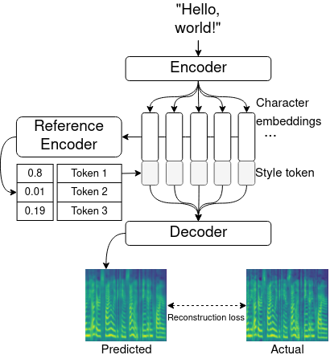
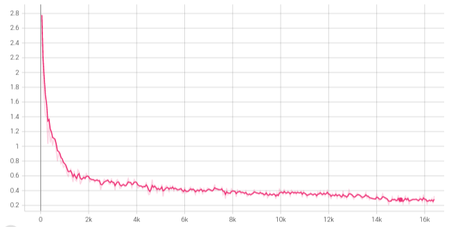
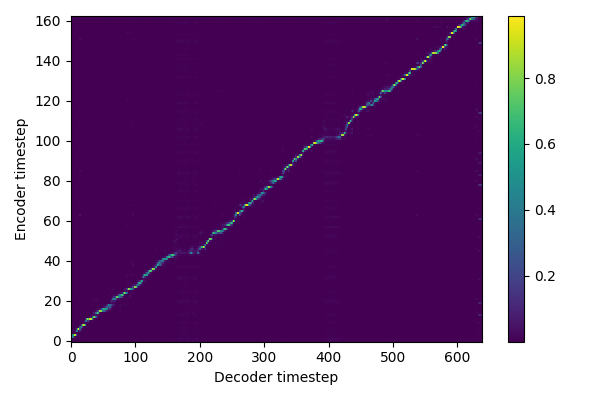
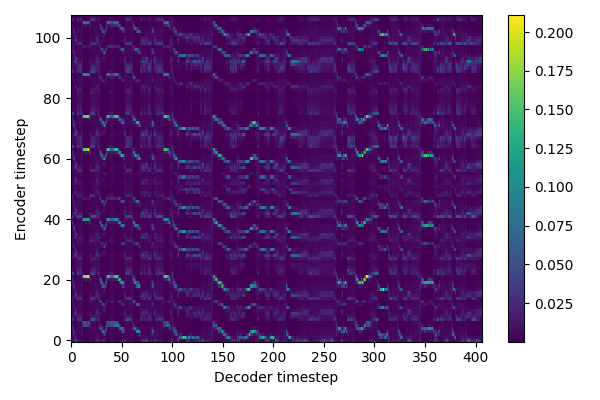
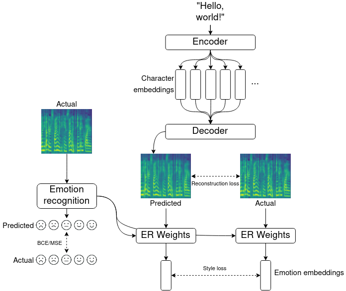
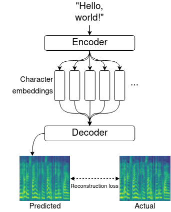

# Log 12-8-21

## New this week

### Summary

* Successfully added the option to train global style tokens to [my Tacotron implementation](https://github.com/mattm458/tacotron2).
* Found a set of hyperparameters and preprocessing that reliably trains Tacotron models, even on heavily modified variants like with GST.
* Beginning implementation of another research project I can use to directly test multi-annotator emotions, but with some caveats.

### Global style tokens

[Implemented](https://github.com/mattm458/tacotron2/blob/main/model/tacotron2.py#L285) based on this paper and [this reference implementation](https://github.com/NVIDIA/mellotron/blob/master/modules.py).

My implementation isn't perfect yet, and my model needs to be trained more. However, you can definitely hear different speaking styles when inference is conducted with different tokens, indicating that the model was able to discern different speaking styles in the data and produce speech. Audio samples are available [here](https://github.com/mattm458/logs/tree/main/audio/gst/12-8-21).

### Training procedure

Training Tacotron is an unusual procedure because loss metrics are not a good indicator of whether the network has learned correct output. Most training runs, even unsuccessful ones, show reconstruction losses like those in the graph below:

The most important indicator of whether the network has learned is its attention weights. These weights align output Mel spectrogram frames with input characters, so it is important for the network to learn which characters are contributing the most to spectrogram frame it is currently producing. Speech output is unintelligible until correct alignment is learned.

|Status|Alignment|
|------|---------|
|Start (i=2000)||
|Correct alignment (i≈10,000)||
|Alignment failure ((i≈8,000))||

If there is a bug in the network code, or if hyperparameters are not properly tuned, alignment may appear like the alignment failure graph in the chart above. If this happens, the network will likely never learn correct alignment, at least not in the timeframe seen in successful training runs. This has been observed occurring in the following situations:

* Improperly trimmed input audio (i.e., silence at the beginning and end of the file)
* Corpuses that use a period at the end of most input texts. Discussions in the [Nvidia implementation issues page](https://github.com/NVIDIA/tacotron2/issues/263) suggests that this, in conjunction with improperly trimmed input audio, can cause problems with the network's ability to understand the purpose of the period.
    * LJSpeech: Not an issue because only half of the examples end with a period
    * M-AILABS: Caused problems because about 80% of the examples end with a period

Based on this, I am using [the following preprocessing techniques to clean up the audio](https://github.com/mattm458/tacotron2/blob/main/datasets/tts_dataset.py). This has worked for both LJSpeech and M-AILABS data:

**Text preprocessing**
1. Use normalized text data from the corpus (i.e., numbers written as words, abbreviations expanded, etc - this is ususally provided).
2. Remove all but the allowed characters.
2. Append a stop token (^)

**Audio preprocessing**
1. Trim silence from the start and end of the audio file
2. Append 1/10 second of silence to the end, intended to align with the stop token.
3. Compute the Mel spectrogram with the parameters shown in the chart below
4. Clamp values to a minimum of 0.00001, then take the log-Mel spectrogram 

| Hyperparameter      | Value                                                    |
|---------------------|----------------------------------------------------------|
| Learning rate       | 0.001                                                    |
| L2 Penalty          | 0.000001                                                 |
| Allowed characters  | 64 (A-Z, a-z, 12 punctuation characters) plus stop token |
| Batch size          | 64                                                       |
| Text preprocessing  | Append stop token                                        |
| Sample rate | Depends on the dataset: 16,000 for M-AILABS, 20050 for LJSpeech  |
| FFT size | 1024                  |
| Window length | 1024                      |
| Hop length | 256                      |
| Minimum frequency | 0                      |
| Maximum frequency | 8000                      |
| Mel filterbanks | 80                      |
| Power | 1                      |

Mel spectrogram hyperparameters are identical to those used by the [Nvidia implementation](https://github.com/NVIDIA/tacotron2/blob/master/hparams.py).

### Next week

I am working on recreating [one more paper](https://arxiv.org/pdf/2008.01490.pdf). I think it has the most potential to act as a testbed for accounting for multiple annotators.

It works by training an emotion detection model on an unrelated emotional dataset like IEMOCAP. They then freeze and transfer the weights from this model into the Tacotron output later, and use it to add an extra loss metric on the produced Mel spectrogram frames. It appears that doing this causes Tacotron to focus on producing output with features important to the emotion detection model.

I like it over other works I've found so far for the following reasons:

* It does not require specialized datasets. It can be trained with both a standard TTS dataset (they use LJSpeech) and an emotion recognition dataset (IEMOCAP).
* It explicitly depends on a deep representation of emotion. Based on this, I can either reuse or adapt the work I did earlier this semester with emotion detection accounting for separate annotators with an autoencoder.
* It doesn't attempt to use predicted emotion labels to influence speech output. Other papers taking this approach actually tried incorporating predicted emotion labels into speech synthesis, either through style tokens or through some other method, which seems clunky and awkward to me.

However, it has some disadvantages:

* The goal of the network is to improve prosody, not to produce emotional speech. They simply use emotion detection is a means to achieve this.
* The output prosody is not controllable, just emphasized.

If I'm going forward with this, I have a specific experiment design that I want to pursue. The goals would be as follows:

1. Recreate the study as-is.
2. Alter the emotion recognition model to account for different annotators, using the disentanglement method I was proposing earlier and/or [something like what Vinod did](https://arxiv.org/pdf/2110.05719.pdf).
3. Get mean opinion scores from my output and compare to the original, likely on a crowdsourcing platform.

My hypothesis would be that the output speech would be more realistic and expressive as a result of detecting emotion as annotated by separate annotators rather than an averaged ground-truth label. It would be confirmed by seeing higher mean opinion scores from a multi-annotator emotion detection model than from the original aggregated ground-truth emotion detection model used in the original paper.

## Done

### Tacotron 2
Implemented [here](https://github.com/mattm458/tacotron2) based on "[Natural TTS synthesis by conditioning wavenet on Mel spectrogram predictions](https://arxiv.org/pdf/1712.05884.pdf)" and [the Nvidia reference implementation](https://github.com/NVIDIA/tacotron2).

## Datasets
|Dataset|Contents|Use|Notes|
|-------|--------|-----|-----|
|LJSpeech|Neutral speech from nonfiction works. Single speaker. Approx. 20 hours.|General speech|Widly used in speech synthesis research. I assumed there isn't enough prosodic variation for it to be used in expressive speech production, but some papers use it for this anyway.|
|M-AILABS|Expressive speech from audiobook recordings. Multiple speakers. Each speaker has approximately the same amount of data as LJSpeect (approx 20 hours).|Expressive speech, multi-speaker speech|Used in some expressive speech research. Can either be used as-is for multi-speaker expressive speech, or with individual speakers. |
|Blizzard 2013|Expressive speech from audiobook recordings. Single speaker. Large amount of data (100+ hours), but only a subset has been segmented and aligned with input text (approx. 20 hours)|Expressive speech|Used in the original GST paper. [Community-provided segmentations](https://github.com/Tomiinek/Blizzard2013_Segmentation) are available for the entire dataset.|