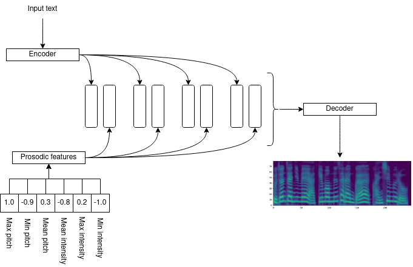
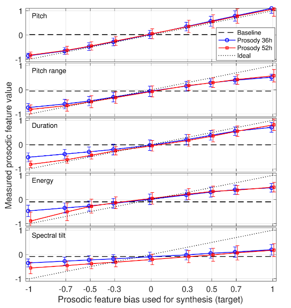

# Log 2-3-22

## New this week

### Summary

* Added the option to train Tacotron 2 with prosody control

### Speaker embeddings

[Implemented](https://github.com/mattm458/tacotron2/blob/main/model/tacotron2.py#L208) based on [these](https://arxiv.org/pdf/2009.06775.pdf) [papers](https://arxiv.org/pdf/1909.10302.pdf).

This architecture allows controlling prosodic features of speech output by using the now-familiar approach of assembling some feature vector and concatenating it with Tacotron encoder output. In this case, the features are normalized feature values (in my case, mean, max, and min pitch and intensity) with part of the encoder output. The feature values are extracted from the TTS dataset (in my case, [LJSpeech](https://keithito.com/LJ-Speech-Dataset/)) prior to training and included in the dataset.

The goal is to be able to specify, alongside input speech, specific values of prosodic features to emphasize in the output text.

### Current Status

The prosody component does work, to a certain extent. Audio samples varying the pitch high and low are available [here](https://github.com/mattm458/logs/tree/main/audio/prosody). However, the speech is not converging and sounds garbled and completely unlike my input text. I have a few ideas as to why this is happening:

* Poorly chosen input features. For some reason, I tried to do min/max/mean pitch and intensity, rather than simply mean pitch as was done in the paper. I am wondering if this type of fine-grained control (i.e., specifying an entire range of pitch and expecting the synthesizer to work within it) is too much for this limited method of feature representation.
* Not enough training. Self-explanatory, easy to fix.
* A poorly-chosen dataset. LJSpeech is very unexpressive. A more expressive dataset like Blizzard 2013 may be more appropriate. However, I am not sure if this is true, because it is possible to control output prosody as demonstrated in the samples linked above, so there must be enough data for at least that component to work correctly.

### Ideas for next week

I noticed in other papers related to Tacotron output control, they use style tokens and their desired features are weights for the tokens (for example, [this paper](https://ieeexplore.ieee.org/abstract/document/9023186) explicitly associates tokens with emotion labels, when I guess according to this architecture they could have just concatenated a one-hot emotion vector directly to the encoder output). I am curious if I might get better results (especially when specifying ranges of features instead of specific feature values) if I try using my feature values as GST weights instead of directly as a feature vector.

I am also curious about whether adding a prosodic prediction module at the end of inference could improve correlation between specified prosody feature values and actual prosody feature values (see [this paper](https://arxiv.org/pdf/2008.01490.pdf) for similar work with emotion expression). This diagram was in the Raitio et al. paper:

They found that requested pitch vs. observed pitch was almost ideal, but less so for other features. But actually nothing about this method encourages Tacotron to produce output of a specific pitch, it is just inferring that the pitch of the audio output is associated with the input feature vector. The Liu et al. paper I linked above suggested that adding a SER model to an emotional Tacotron model could encourage the model to focus on producing speech features associated with a given emotion. I'm wondering if something similar could help improve the output for prosodic features too:

