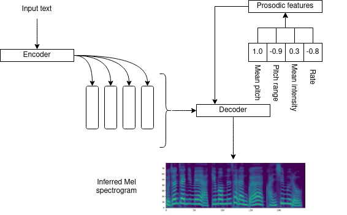
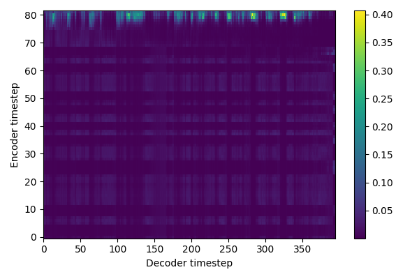
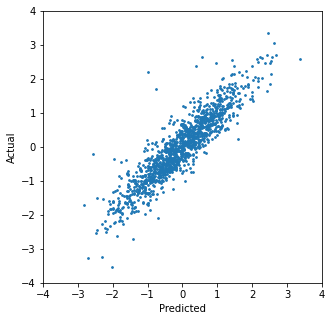

# Log 2-17-22

## New this week

### Summary

* Revised Tacotron prosody control, training on more features
* Designed and trained a pitch prediction network

### Tacotron prosody control v2

I realized my implementation of the Tacotron prosody control system was not quite the same as the paper, so I revised it to more closely resemble it. My original version had prosody information concatenated to the encoder output (prior to the prenet and the attention layer), but actually it was supposed to be concatenated into the input to the decoder LSTM (after the prenet and the attention layer).

I am not completely sure about the difference between these, but here are some thoughts. The paper references the idea that you can concatenate the prosodic features to the encoder output instead of the decoder input, but within the speculative context of adding granular phoneme-level prosody control. This suggests that you would append style information to encoder output if the style is associated with individual phonemes, and you would append style information to decoder input if the style is associated generally with the sentence as a whole. It seems like they think it's a question of which you want to influence more: the decoder generally when it's producing output, or the individual components of a sentence. I'm not sure how much I buy this, since GSTs are combined with encoder outputs despite ultimately being applied to the sentence as a whole, but this is what the paper argues.

I noticed that concatenating prosodic features with the encoder output can lead to attention issues:

This is still very early in training, but from my understanding of the common knowledge around training Tacotron models, if your attention plot looks like this early in training, it is unlikely to learn good alignment later. I believe this is the result of concatenating prosodic feature vectors to otherwise empty padding timesteps containing zeros, and it's distracting the attention mechanism. I was able to resolve this by zeroing out the prosodic features extending past the end of the useful encoder output data, but ultimately became irrelevant once I moved the prosodic feature vector to the decoder input.

Other revisions:

* Cleaned up the prosodic features. They now mostly match the paper: mean pitch, pitch range, mean intensity, and speaking rate. I am not calculating them the same way as the paper does, but I am not sure it will matter in the end. The paper also uses spectral tilt, but I am not including this for now.
* The paper uses log-pitch, log-pitch range, log-intensity, and log-rate. I now do this before normalizing them.
* The paper throws out any samples where the prosodic features are outside the range of (-1, 1). I do not do this. I believe they do this because their prosody prediction model uses tanh before the final output, but since I'm not using a prosody prediction model, I don't have that range to stay inside.

### Pitch prediction network

Based on our discussion last week, I decided to try designing a network that can predict mean pitch from an input Mel spectrogram. I found several people doing this, but I felt none of the models were particularly suited to what I tried to do (I couldn't find any using Mel spectrograms as input, and the outputs were rarely ever just the mean pitch for an entire audio sample). So in the interest of getting something done, I adapted the Tacotron convolutional character encoder and used an LSTM to summarize the results.

It seems to work OK: The MSE loss is just below 2.0, and the correlation between predicted and actual pitch values is almost perfect (r=0.91, p≈0).

At this point, I can do one of three things:

* Continue refining the model (possibly to make it more similar to other similar models, but adapted to my use case).
* Experimenting with using the model to influence mean pitch in Tacotron output, ignoring other prosodic features.
* Experimenting with adding other prosodic features to the model.