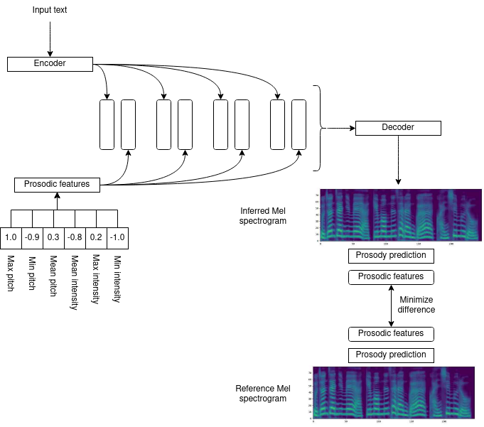
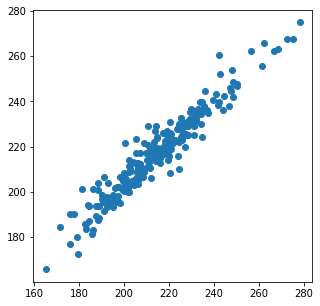

# Log 2-24-22

## New this week

### Summary

* Fixed issues with Tacotron output, and can now produce intelligible speech from any input (with caveats, see below).
* Implemented a prosody detection module as part of final Mel spectrogram loss computation as described in [this update](https://github.com/mattm458/logs/blob/main/2-10-22.md)
* Evaluated different methods of training with additional prosody detection
* Performed a preliminary analysis of the difference between mean pitch with and without the prosody detection module

### Tacotron prosody control v3

I did two things this week that led to an improved ability to produce working Tacotron models. First, there was a bug in my code that accepts arbitrary textual input that prevented it from working (the encoded characters were all off by 1). I also cut down the training time by doing a few things to optimize my model and increase the batch size. I can now reliably produce a working Tacotron model, with or without prosody control, in about 100-150 epochs.

An older image from last time:

I implemented the system as depicted above. It introduces a pretrained prosody detection model with frozen weights at the end of the Tacotron network, reading Mel spectrogram output and predicting mean pitch. This mean pitch predicted from the output is compared with the mean pitch detected from the reference Mel spectrogram, and the mean squared error between them is introduced to loss calculations.

In getting here, I tried three separate approaches:

* Jointly train the prosody prediction model and Tacotron from scratch at the same time. I realized this was a bad idea because the prosody prediction model was predicting a value being fed into the decoder, so there was no way it was doing anything useful. I abandoned this approach.
* Train Tacotron from scratch with a pretrained prosody prediction model. This seemed promising. Unfortunately, the Tacotron model failed to converge and never learned proper input alignment, even after several retries. I guessed that the added emphasis on the Mel spectrogram output was too much to learn attention, so I abandoned this approach too.
* Continue training a pretrained Tacotron model with the addition of a prosody prediction model. This worked.

The prosody prediction model appears to have a very small impact on the mean pitch of Tacotron output. Without the prosody prediction model, the correlation between input pitch and output pitch is r=0.947, whereas with the prosody prediction model, the correlation is r=0.960, both with negligible p-values. 

 

This is both good to see and a little disappointing, although there was already a very tight correlation between input and output pitch (and this was expected from the Apple paper from before). Having said that, this is only the beginning of the analysis - this is with test data generated through teacher forcing, which is kind of cheating because it's using the expected Mel spectrogram as input to subsequent decoder timesteps. I am currently looking into what happens without teacher forcing (i.e., the model only makes predictions by feeding its prior predictions into itself), and that is looking less clear.

The model is still pretty bad at producing completely inferred output from arbitrary input text, and I am starting to consider whether I should go back and retrain it without teacher forcing on all the time.