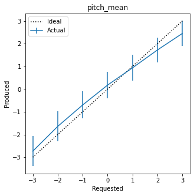
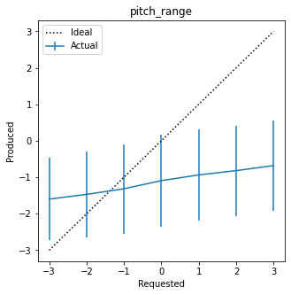
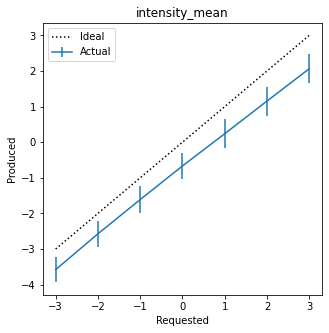
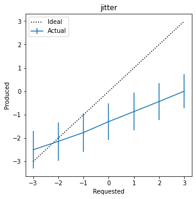
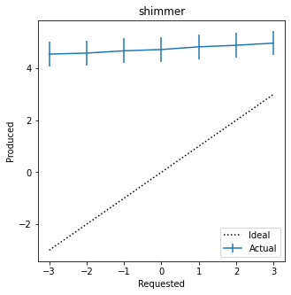
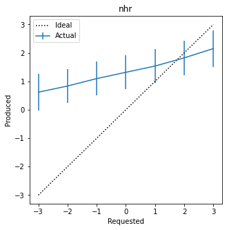
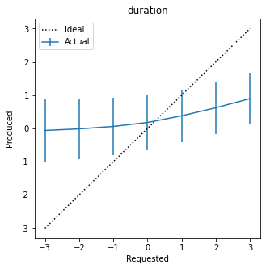

# Log 3-10-22

### Summary

This week, I did some last-minute cleaning up and retraining of Tacotron and the prosody prediction module, and ended up with what I'm calling a definitive trained model for both for now.

The bulk of my work was producing the chart shown below, indicating the effect of fine-tuning a trained Tacotron model with a frozen prosody prediction model. With these experiments, the prosody prediction model acts as additional fine-tuning on Tacotron's output, forcing it to produce the kind of features that the prosody prediction model is looking for.

I also began investigating neural vocoders this week. I was looking into them with the goal of finding one which might be able to accept prosody control (I am still suspicious that things like jitter and shimmer would be better controlled there). However, I came up empty-handed - I'm not sure any of them would work with prosody control.

My primary options for vocoders seem to be WaveNet and WaveRNN, though there are many others (there does not seem to be any serious advantage of one over another). WaveNet is completely convolutional, but WaveRNN uses a recurrent network. However, both appear to process the output in small chunks, not the entire spectrogram at once. So I am skeptical that I can introduce prosodic features and expect the vocoder to coherently apply it across the entire spectrogram. I will keep looking.

### Tacotron prosody control results v2

|   |  Vanilla Prosody Control | Tacotron with prosody conditioning  |
|---|---|---|
| Pitch Mean     | r=0.936   ccc=0.922   | r=0.941   ccc=0.937    |
| Pitch Range    | r=0.099   ccc=0.076    | r=0.251   ccc=0.185    |
| Intensity Mean | r=0.954   ccc=0.567   | r=0.979   ccc=0.918    |
| Jitter         | r=0.712   ccc=0.616   | r=0.727   ccc=0.482    |
| Shimmer        | r=0.210   ccc=0.014   | r=0.291   ccc=0.022   |
| NHR            | r=0.558   ccc=0.127   | r=0.635  ccc=0.313     |
| Duration       | r=0.425   ccc=0.309   | r=0.350  ccc=0.259    |

For the chart above, I produced speech output for the entire test set with all prosodic values set to 0, except for one which I varied one at a time from -3 to 3. I evaluated two versions of Tacotron: a Tacotron model with unconditioned prosody control trained to 400 epochs, and the same model fine-tuned for an additional 125 epochs with additional conditioning from the frozen prosody detector model.

The additional conditioning improved the Pearson correlation between the requested prosodic value and the produced prosodic value for pitch mean, pitch range, intensity mean, jitter, shimmer, and NHR.

In some situations (for example, NHR, shimmer, and mean intensity), the non-conditioned Tacotron model was producing output with dramatically exaggerated prosodic features, well outside the (-3, 3) range that was requested, or output that was linearly correlated but offset from the ideal. In these situations, adding the conditioning did not always produce highly correlated output, but at least appeared to pull the output prosody back into a more reasonable output range. This correction is highlighted in the concordance correlation coefficient (CCC), which is similar to Pearson's R but also accounts for the distance from the 45-degree perfect correlation. This was most notable for mean intensity, which gained .025 in correlation but .351 in CCC.

### Questions and next steps

Here are things I am planning to investigate next:

* Are we sure the conditioning was solely responsible for the improvement? What if I just continue training the original Tacotron model for an additional 125 steps? (I think it actually made a difference based on watching the loss during training, but I should check to be sure).
* The conditioned Tacotron model appeared to plateau around 125 timesteps, but I wonder if I might see improvement for some of the worst speech features if I continue training.
* Is it better to compare the prosody model's error between ground-truth Mel spectrograms and the generated Mel spectrograms? Can't I just test for the specific prosody value I'm looking for instead?
* I think my conception of duration and pitch range are flawed (pitch range is log(max - min), and I'm not sure if it should be log(max) - log(min)). Also, I think my duration calculations might be flawed - I'm investigating that.

Longer term things to investigate:

* The prosodic features are calculated using Praat from a waveform generated by Griffin-Lim. It is definitely time to add a vocoder.
* Is there a better way to model some of the worse-performing speech features in the prosody predictor? Shimmer and pitch range were never very good.