# Log 3-10-22

### Summary

This week, I did two major things:

1. Worked on some additional evaluations for the prosody control conditioning I did last week.
2. Began an implementation of Wave RNN, which is ongoing.

### Tacotron prosody control results v3

One of my questions from last week was whether conditioning Tacotron output on a trained prosody control module actually helped, versus just continuing to train Tacotron for the 125 extra epochs. Here is the result of that test:

|   |  Vanilla Prosody Control |Vanilla Prosody Control (+125 epochs) | Tacotron with prosody conditioning  |
|---|--|-|---|
| Pitch Mean     | r=0.936   ccc=0.922   | r=0.926   ccc=0.917  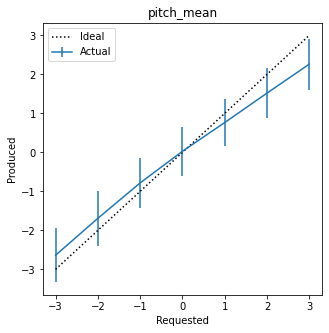 | r=0.941   ccc=0.937    |
| Pitch Range    | r=0.099   ccc=0.076    | r=0.192   ccc=0.149  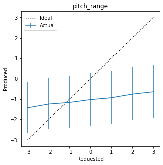 | r=0.251   ccc=0.185    |
| Intensity Mean | r=0.954   ccc=0.567   | r=0.954   ccc=0.546  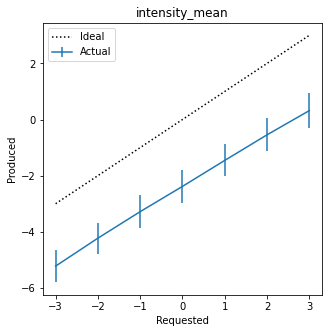 | r=0.979   ccc=0.918    |
| Jitter         | r=0.712   ccc=0.616   | r=0.653   ccc=0.564  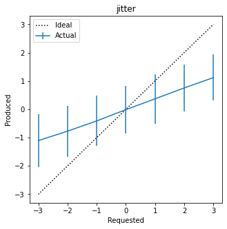 | r=0.727   ccc=0.482    |
| Shimmer        | r=0.210   ccc=0.014   | r=0.311   ccc=0.022  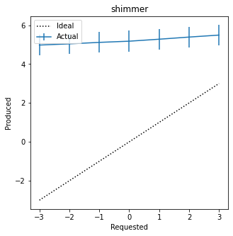 | r=0.291   ccc=0.022   |
| NHR            | r=0.558   ccc=0.127   | r=0.546   ccc=0.141  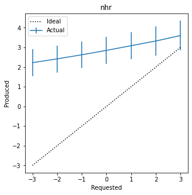 | r=0.635  ccc=0.313     |
| Duration       | r=0.425   ccc=0.309   | r=0.342   ccc=0.254  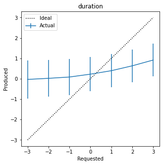 | r=0.350  ccc=0.259    |

Looking at a combination of these numbers and the [prosody control model results](https://github.com/mattm458/logs/blob/main/3-3-22.md), it appears that:

* The prosody model definitely makes a difference for features that the prosody model is good at detecting (mean pitch, mean intensity, and NHR).
* For features that the prosody model isn't as good at detecting (duration, shimmer, and pitch range), the results are mixed. Duration and pitch range got better, shimmer was worse.
* I can't explain jitter: the model is pretty good at detecting it, but the results are mixed here. The r-value is better, but the correlation coefficient is worse.

### Normalized prosody control results

I also tried again with a different normalization method applied to the features, and this is actually what is done in the original paper. I had originally neglected to do this because my initial impression was that restricting them to a range of (-1, 1) was only done for the benefit of a separate prediction model (the paper predicts appropriate prosodic features from an input text, whereas I don't care and just want to specify it manually). However, I wondered if this might improve the results of my prosody prediction model, so I tried it.

Prosody control model results:

| | Prosody predictor output | Prosody predictor output (V2 normalization)
|-|--------------------------|-|
|Pitch Mean     | r=0.905    | r=0.937   ccc=0.912   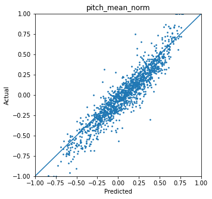 |
| Pitch Range	| r=0.509   | r=0.729  ccc=0.703  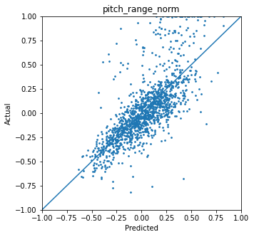 |
| Intensity Mean | r=0.946   | r=0.962 ccc=0.956   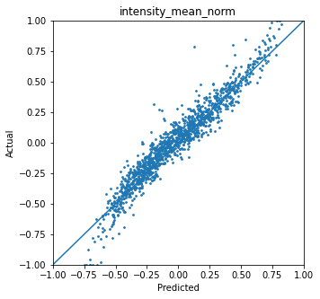 |
| Jitter         | r=0.809   | r=0.831 ccc=0.821   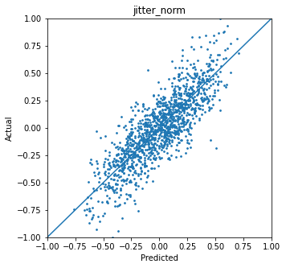 |
| Shimmer        | r=0.567   | r=0.603 ccc=0.553   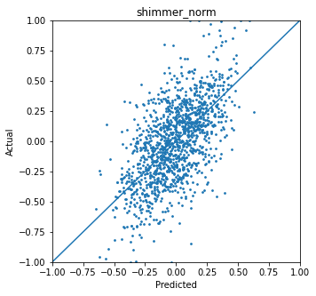 |
| NHR            | r=0.811   | r=0.838 ccc=0.821    |
| Duration       | r=0.754   | r=0.819 ccc=0.799   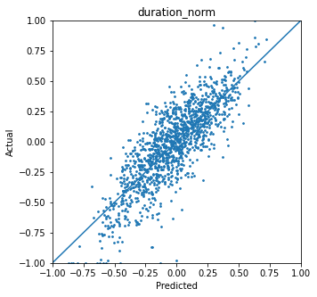 |

With these new numbers, the prosody predctor output is universally better for all features (especially pitch range!)

Results on tacotron output (without conditioning) are shown below:

|   |  Vanilla Prosody Control |Vanilla Prosody Control (V2 normalization) |
|---|--|-|
| Pitch Mean     | r=0.936   ccc=0.922   | r=0.947   ccc=0.921   |
| Pitch Range    | r=0.099   ccc=0.076    | r=0.630   ccc=0.379   |
| Intensity Mean | r=0.954   ccc=0.567   | r=0.948   ccc=0.509   |
| Jitter         | r=0.712   ccc=0.616   | r=0.585   ccc=0.456   |
| Shimmer        | r=0.210   ccc=0.014   | r=0.232   ccc=0.017   |
| NHR            | r=0.558   ccc=0.127   | r=0.547   ccc=0.151   |
| Duration       | r=0.425   ccc=0.309   | r=0.466   ccc=0.333   |

I believe the improvement in pitch range came from a slight tweak in how I was calculating it (I noticed the paper computes it based on the 95th and 5th percentiles, whereas I was just using Praat pitch output directly). I'm not sure how to interpret the rest of the results, though I think it might become clearer once I finish training a Tacotron model conditioned on this new prosody prediction model. This is in progress. I am expecting it to be much better due to the better quality of the prosody prediction model.

### Vocoder

I am currently working on an implementation of WaveRNN. As I mentioned in the last update, the official Tacotron paper uses Wavenet, but in practice different Tacotron implementations use any of a number of different neural vocoders (Waveglow, WaveRNN, Wavenet, and a few others) and it appears to be generally unclear if one is better than another.

This is ongoing and I am hoping to have it working by next week. I chose WaveRNN because I am hypothesizing (admittedly without much evidence) that it will do better being conditioned on prosodic features because of the recurrent aspect. However, I am concerned about maintaining prosody consistently across the entire output: most implementations of all vocoders break the input into small chunks instead of operating on the entire Mel spectrogram, and I'm concerned that later chunks may not have the benefit of the RNN's hidden layer. But we'll have to see.

### Questions and next steps

Here are my immediate next steps:

* Finish the WaveRNN implementation.
	- Test WaveRNN on prosodic conditioning, with an emphasis on jitter, shimmer, and NHR
* Finish training Tacotron conditioned on the new prosody predictor (this is currently training) and evaluate against the previous results.

After this, I'm not sure where to go - I'd like to take a step back and evaluate where we are and if it's worth trying to engineer a dialogue system as a secondary project. Also, I'm starting to do research into Tacotron in a conversational context after finding [this paper](https://arxiv.org/pdf/2106.06233.pdf): they condition Tacotron output on a context vector accumulated from conversation history. But we can talk about that next week.