# Log 3-24-22

### Summary

This week, I did two major things:

1. Finished Tacotron prosody control training
2. Finished WaveRNN training
	* Trained a new 22,050 kHz Tacotron to pair with the vocoder (was previously 16,000 kHz)

### Normalized prosody control v2

|   |  Vanilla Prosody Control |Vanilla Prosody Control (V2 normalization) | Conditioning (V2 normalization)
|---|--|-|-|
| Pitch Mean     | r=0.936   ccc=0.922  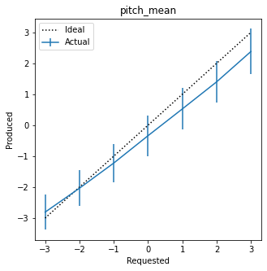 | r=0.947   ccc=0.921  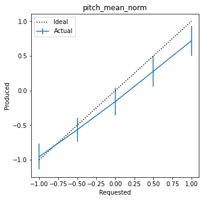 | r=0.955   ccc=0.897  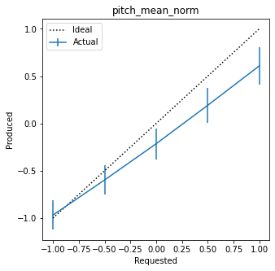 |
| Pitch Range    | r=0.099   ccc=0.076   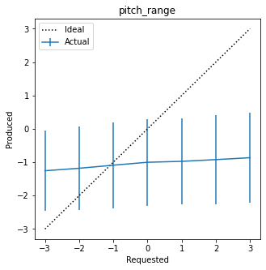 | r=0.630   ccc=0.379  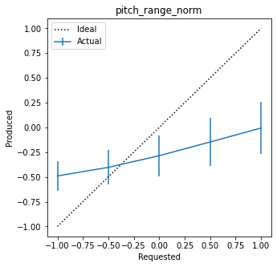 | r=0.661   ccc=0.370  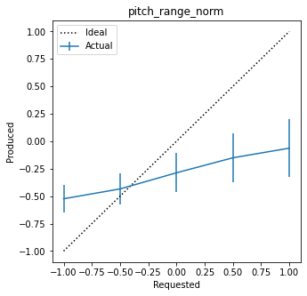 |
| Intensity Mean | r=0.954   ccc=0.567   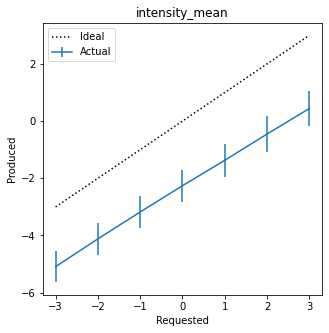| r=0.948   ccc=0.509  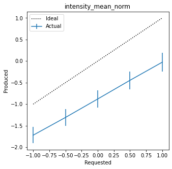 | r=0.966   ccc=0.804  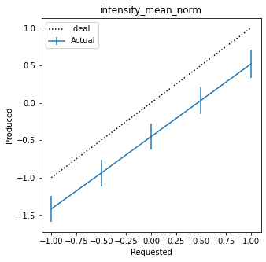 |
| Jitter         | r=0.712   ccc=0.616   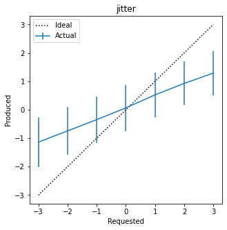| r=0.585   ccc=0.456   | r=0.590   ccc=0.442  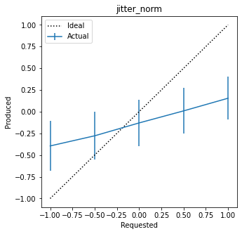 |
| Shimmer        | r=0.210   ccc=0.014   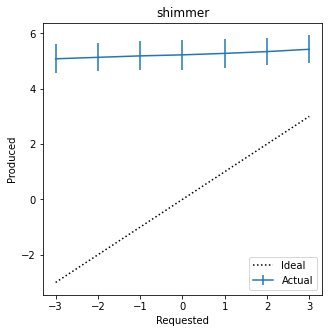| r=0.232   ccc=0.017  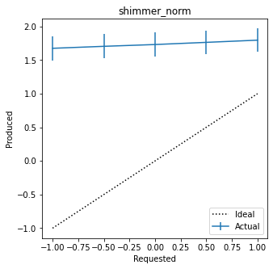 | r=0.242   ccc=0.019  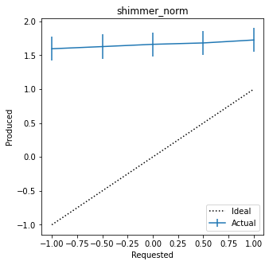 |
| NHR            | r=0.558   ccc=0.127   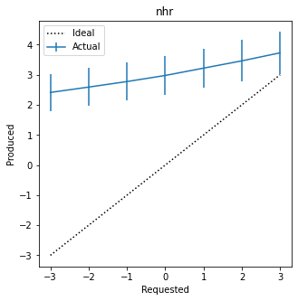| r=0.547   ccc=0.151  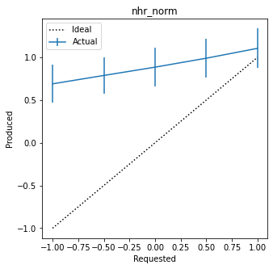 | r=0.577   ccc=0.199  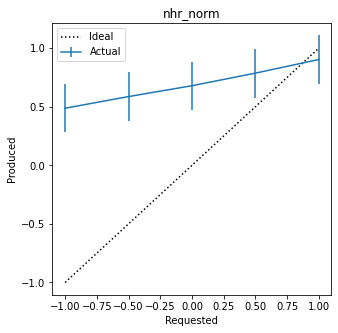 |
| Duration       | r=0.425   ccc=0.309   | r=0.466   ccc=0.333  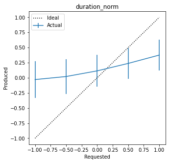 | r=0.416   ccc=0.297  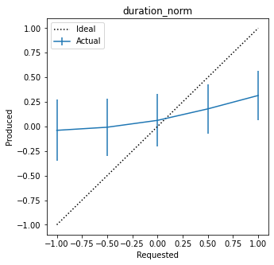 |

This ended up not being as definitive as I hoped - some modest improvements, sometimes at the expense of CCC. In some cases, the correlation got slightly worse (duration, for example).

### Vocoder sample

[Four score and seven years ago](audio/wavernn-0.wav)