# Log 3-3-22

## New this week

### Summary

* Prosody prediction model now capable of jointly predicting many prosodic features associated with entrainment studies, including pitch, intensity, jitter, shimmer, NHR, and duration.
	- It is better at predicting some features than others, but it is possible more training time could resolve this.
* Tacotron issues around prediction and teacher forcing are resolved. Output is intelligible. A new Tacotron model was trained with controls for pitch, intensity, jitter, shimmer, NHR, and duration.
* Performed a preliminary fine-tuning training session with the prosody prediction model. Results are mixed, but seeing some consistency with earlier attempts
	- More training is needed

### Prosody prediction

I improved the prosody prediction model significantly from last week. It is now capable of predicting all of the following prosodic features listed below. Correlations depict the relationship between actual feature values and predicted feature values:

| | Prosody predictor output |
|-|--------------------------|
|Pitch Mean     | r=0.905   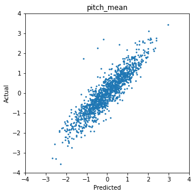 |
| Pitch Range	| r=0.509   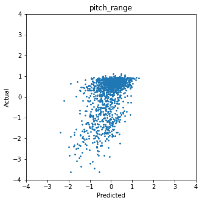|
| Intensity Mean | r=0.946   |
| Jitter         | r=0.809   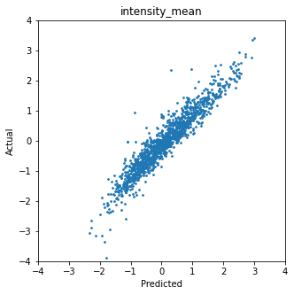|
| Shimmer        | r=0.567   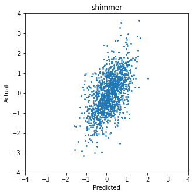|
| NHR            | r=0.811   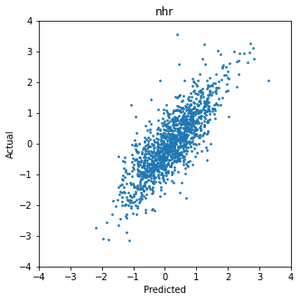|
| Duration       | r=0.754   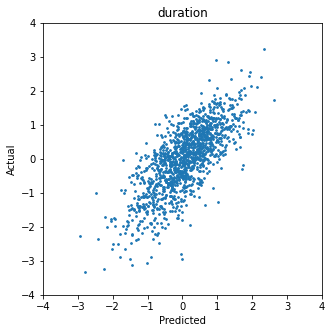|

A major reason why this was possible was because I altered the model structure. Previously, it was a relatively simple convolutional network with an RNN, based partially on the Tacotron prenet. However, this was unstable, prone to overfitting, and unable to learn any reasonable correlation between some of the more "difficult" features above like shimmer. I adapted the emotion prediction network from [this paper](https://ieeexplore.ieee.org/document/8421023) instead, which largely has the same structure as before but with a few alterations:

	* The input is a 3-layer tensor consisting of the log-Mel spectrogram, its delta, and the delta's delta.
	* There is an attention mechanism to help the network ignore silences and other irrelevant input frames.
	* The convolutional network is deeper.

After adopting this model, training was much more stable and did not overfit. I trained it for 200 epochs, but could have gone longer.

### Tacotron prosody control results

After completing the above, I began retraining my previous Tacotron instance with the prosody control model as additional conditioning on the output log-Mel spectrogram. This is still ongoing, as I am currently experimenting with hyperparameters like the earning rate and batch size parameters. Since it is fine-tuning, it seems likely that I can alter these to have the additional conditioning make less of an impact on the network. It is also unclear how long I need to train the network during fine-tuning. However, I am seeing small but clear downward trends in the loss during training, so it is adapting to the fine-tuning.

This is the results of a preliminary look into fine-tuning the model with approximately 50 epochs. Pitch, mean intensity, jitter, and duration show slight improvement, while the others are slightly worse. It is possible some of this is due to random variation. However, at least the improvement in pitch is consistent with my previous attempt at doing this, and I suspect longer training will help improve these more.

|   |  Vanilla Tacotron | Tacotron with prosody conditioning  |
|---|---|---|
| Pitch Mean     | r=0.801   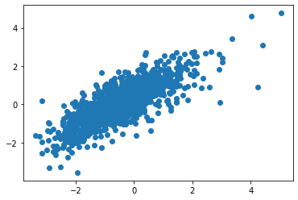 | r=0.829   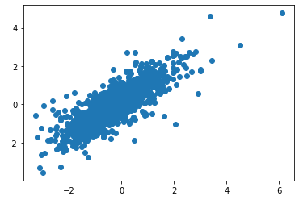 |
| Pitch Range    | r=0.291    | r=0.286   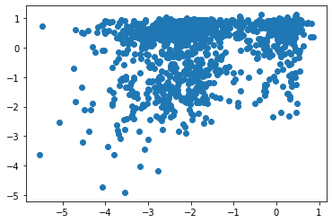 |
| Intensity Mean | r=0.868   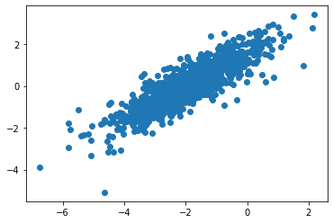| r=0.871   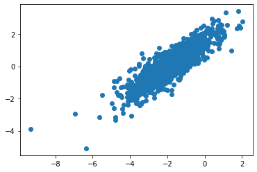 |
| Jitter         | r=0.632   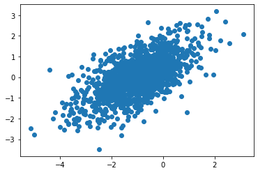| r=0.649   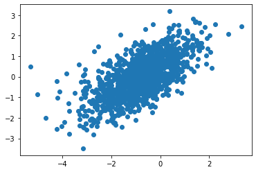 |
| Shimmer        | r=0.409   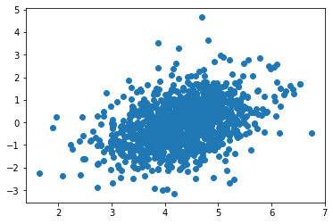| r=0.376  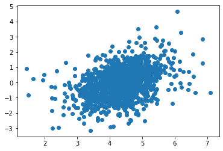 |
| NHR            | r=0.676   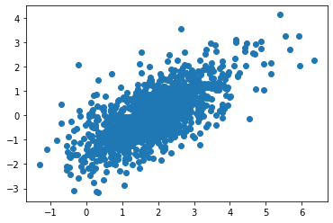| r=0.663  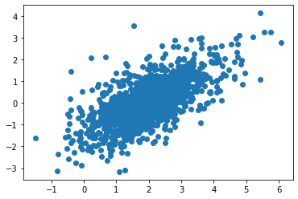  |
| Duration       | r=0.920   | r=0.928  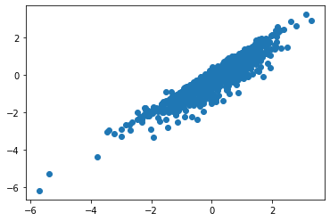 |

I currently have a fine-tuning model training in progress.

I am suspicious that some of the more complex features (jitter, shimmer, and NHR) may not be appropriate to do at the decoder level, since Tacotron only outputs log-Mel spectrograms. These may be more appropriate to introduce at the vocoder level. I still have not looked into the Wavenet vocoder typically used instead of Griffin-Lim - now is probably a good time to do this.

### For next week

* Finish longer Tacotron finetuning training session and compare results
* Implement and begin training Wavenet vocoder, if doing this now seems like a good idea.
	- As part of this, research whether other people are introducing prosody control there.