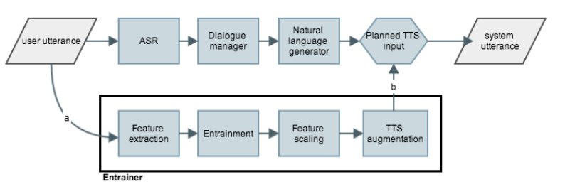
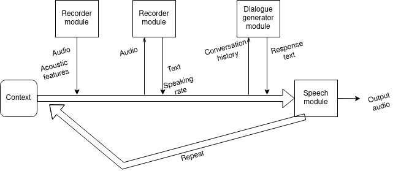

# Log 3-31-22

### Summary

This week, I did two major things:

1. Wrote a modular spoken dialogue system capable of rudimentary entrainment to its human interlocutor, based on the dialogue system diagram in [Levitan et al. 2016](https://www.isca-speech.org/archive_v0/Interspeech_2016/pdfs/0985.PDF).
2. Trained a WaveRNN model with prosodic features as part of its input, though analysis is proving more challenging than I expected.

### Spoken dialogue system

I would still consider this a prototype, but it is available [here](https://github.com/mattm458/dialogue). It is based partially on [Levitan et al. 2016](https://www.isca-speech.org/archive_v0/Interspeech_2016/pdfs/0985.PDF), and attempts to recreate the following system diagram:

 

The design of the dialogue system is meant to be modular. As it progresses through each step, it accumulates a context object, which contains historical conversation context and extracted features. The dialogue system includes the following components:

* A recording module that listens for user speech and records it when available. It is implemented with recording functionality from the Python SpeechRecognition library, and because of this it can adjust for background noise and automatically start and stop recording.
* An ASR module that accepts speech data and converts it to text. This is also based on the Python SpeechRecognition library. It runs a local Sphinx ASR model, but the library is capable of calling out to remote ASR services like Google, Microsoft, and IBM.
* A dialogue response generator module that accepts a conversation history and produces a next response. Currently, two are available:
	- An ELIZA response generator, which uses the most recent user utterance and the ELIZA dialogue system to produce a response.
	- A DialoGPT response generator, which feeds the entire conversation history into a HuggingFace DialoGPT model.
* An output audio generator module that accepts generated response text and speaks an appropriate response. Currently, the system has a PyTTSx3 module, which uses the primitive eSpeak synthesizer.
	- Currently, the entire "entrainer" as depicted above is contained within this audio output generator model, which has access to audio features extracted at each step in the process. The entrainer adjusts the eSpeak synthesizer's pitch and speaking rate to approximately match that of the user's voice, though it is not exact and more of a proof of concept.

The flow of the system approximately looks like this:

 

Because this was implemented as a proof of concept, it does not yet interact with my Tacotron model. However, creating a Tacotron speech module is the next step. I am expecting that the naive proof-of-concept entrainment I designed into the system will work better with Tacotron than with eSpeak, since my Tacotron model uses input prosodic features on the same scale as what I am extracting from recorded audio (I am using Praat).

If you're lucky, we can demo it today.

### WaveRNN with prosodic features

In addition to the above, I trained a new WaveRNN model that accepts the same prosodic features as input as the Tacotron model. The hope is that doing so would produce better output, but I am unfortunately unable to complete an analysis of its output due to the extremely slow inference time of my current model (about 5 minutes per audio sample). Given that I focused on the dialogue system this week, I am going to work on improving the speed of WaveRNN inference this upcoming week. The original paper was able to do this by sparsifying the model (i.e., by eliminating unnecessary weights), so I am going to look into this.