# Log 4-14-22

### Summary

Two major things this week:

1. Optimizing WaveRNN is going well. I am adopting a batching technique from the original paper that significantly reduces inference time.
2. The dialogue system now has two entrainment strategy modules.

### WaveRNN optimization

I adopted the Subscale WaveRNN approach from the [original WaveRNN paper](https://arxiv.org/pdf/1802.08435.pdf), with assistance from [this blog post](https://medium.com/papercup-ai/subscale-wavernn-f91fc9c7a106).

The system is complicated and requires an elaborate batching strategy, both when training WaveRNN and during inference. However, in some early tests, it reduced inference time of a single LJSpeech training example from about 7-8 minutes to about 8 seconds. Further tweaking the subscale batch size resulted in an inference time of about 4 seconds. I think this is still too long for a production-quality dialogue system, but it is much better than before, and it's good enough to incorporate into the system for development and testing purposes.

Here is a brief attempt to explain how it works:

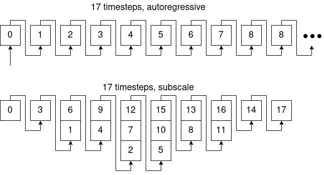

In the image above, we are conducting inference on a 17-step input (in my case, each of the 17 steps is a slice of a stretched Mel spectrogram). In a traditional autoregressive approach, each output of the waveform depends on the output of the previous timestep, so each step must be generated in sequence.

Subscale WaveRNN proposes breaking the input into N batches (in the example image, there are 3 batches), where the input timesteps are staggered across the batches. In addition to the batching strategy depicted above, Subscale WaveRNN introduces the idea of a context vector that supplements the recurrent hidden state. The context vector consists of a windowed look into previously generated output timesteps, and is constructed in a way where *most* timesteps have access to both *past and future timesteps*, but *some* timesteps have access to little or no context. An example set of batches is given below:

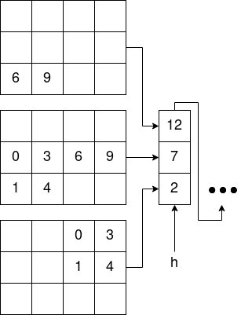

This example focuses on the subscale batch containing 12, 7, and 2 from the previous figure. In this example, 12 has access to previous timesteps 0 and 3; 7 has access to previous timesteps 0, 3, 6, 1, 4 and future timestep 9; and 2 has access to previous timesteps 0, 1 and future timesteps 3, 4.

The Subscale RNN paper argues this kind of context is necessary, because WaveRNN depends on context to produce smooth, intelligible output. Note that the input is __not__ cleanly split into batches like one might expect, as illustrated below:

The concern with this type of batching is that there is no way to preserve context across each batch, which the paper observed leads to noise and distortions at the boundaries where the batches are reassembled in the final output. The subscale batching strategy is a way of smoothing over gaps between batches *for most timesteps*, with only a few at the beginning that completely lack context.

My implementation works as described above, with a few caveats:

* Previously, I used an embedding layer to represent each of the 1024 bits it is possible for the network to output. Currently, my implementation of subscale RNN does not have this, since I am not sure how to deal with the large tensor dimensionality it produces. The embedding layer was an undocumented addition to the WaveRNN implementation I based my work on, and it was not part of the original paper, so I'm not sure how much I care about it.
* My implementation currently does not have a convolutional layer for the context vector like the blog post's GitHub implementation. However, I am not sure if it is necessary, since it appears to be based on the convolutional layer of a very specific WaveRNN implementation and was not present in the original paper. My non-subscale WaveRNN also didn't have this kind of convolutional layer and it worked fine.
	- I suspect it may become necessary if I switch back to bit embeddings.
* For the sake of simplicity, I removed feature vectors. I will add them back once I'm happy with how the network performs.

One last point: Using this batching strategy explodes your memory requirements. If you're expecting to use a minibatch size of 32 with 16 subscale batches, then your total effective minibatch size is actually 32 * 16 = 512. Every timestep in the batch requires a context vector (it is about 170x7 in the blog post), which consumes even more memory. So training a subscale WaveRNN model requires you to carefully tune your batch sizes.

### Entrainment strategies

This section describes three entrainment strategies I developed. The purpose of these strategies is to straightforwardly mimic the vocal characteristics of the speaker as closely as possible, so one might consider them a form of either synchrony or similarity. All 3 strategies are concerned with translating the speaker's utterances to the domain of feature values used in Tacotron.

#### Speaker-relative strategy

I believe this strategy most resembles synchrony, with some elements of convergence introduced as a natural consequence of the algorithm.

For this strategy, the agent will attempt to establish a baseline for a user, and directly produce normalized feature values indicating only if an utterance is high or low for that person. This, in turn, translates directly to normalized feature values for Tacotron. If the strategy is unable to determine a value (specifically, if there are so few pieces of data that the standard deviation is 0), it falls back to a neutral value of 0.

The charts below show the results of this strategy applied to a subset of 50 short recordings from LJSpeech. The inferred feature values were computed with the cumulative features of the 250 recordings as they were available, mimicking a series of dialogues occurring in a live dialogue system. The inferred values are compared with the actual values, computed using the entire dataset as a baseline. The actual values represent what the inferred value might have been if the strategy had access to more speaker data.

| Feature        | Correlation | Difference over time |
|----------------|-------------|----------------------|
| Pitch mean     ||                     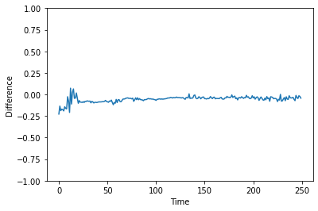|
| Pitch range    |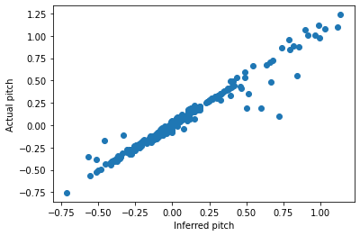|                     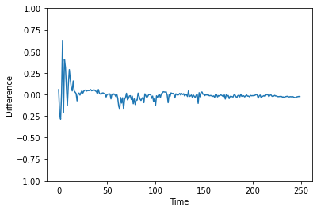|
| Intensity mean |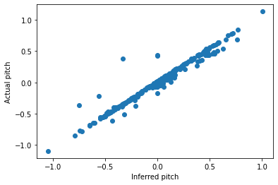|                     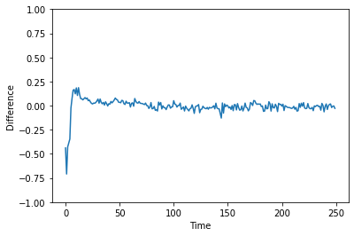|
| Jitter         |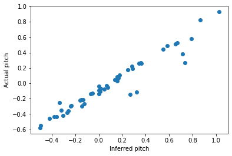|                     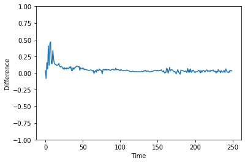|
| Shimmer        |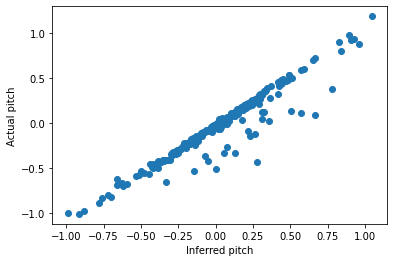|                     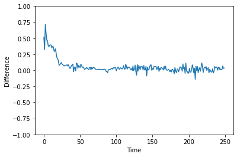|
| NHR            |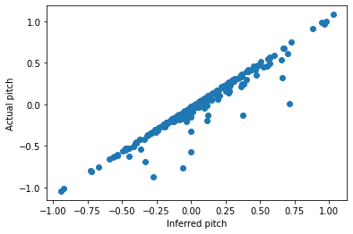|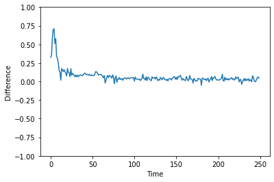|
| Duration       |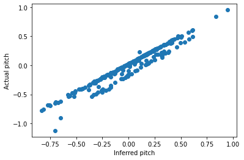|                     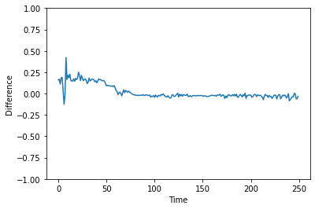|

This strategy eventually produces highly correlated values where the inferred value is very close to the actual value. However, there is an unstable period at the beginning where there is sufficient data to compute a value, but insufficient data to have it fall within the speaker's natural range.

#### Range strategy

I believe this strategy most resembles synchrony.

For this strategy, the agent uses a mapping between gender feature ranges. It can be set up with the gender of both the agent's voice and the gender of the user the agent is speaking with.

I initially tried to research typical ranges for our features, but this didn't help much. Pitch was pretty easy to do (and the LJSpeech corpus fits in with established ranges I found elsewhere). However, there are so many ways of calculating things like jitter and shimmer that I couldn't find anything within the value ranges we have, so I fell back to corpus analysis as a substitute. The female ranges are extracted from the LJSpeech corpus (which I think is appropriate, given that it is the voice of my Tacotron model). Male ranges are extracted from several of the B-MIC sessions with male participants. I don't think this analysis is that great at the moment, but it was enough for now and got me something to work with.

| Feature        | Correlation | Difference over time |
|----------------|-------------|----------------------|
| Pitch mean     |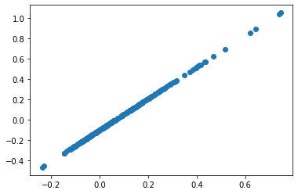|                     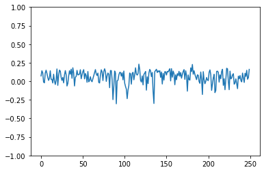|
| Pitch range    |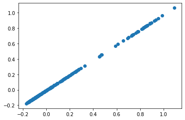|                     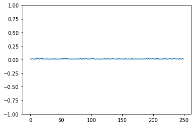|
| Intensity mean |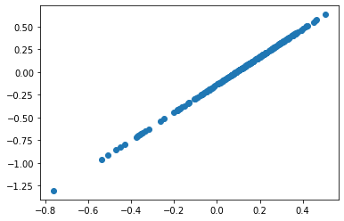|                     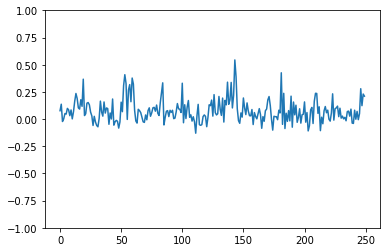|
| Jitter         |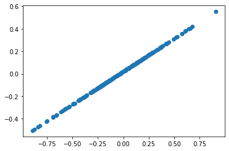|                     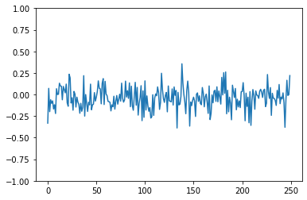|
| Shimmer        |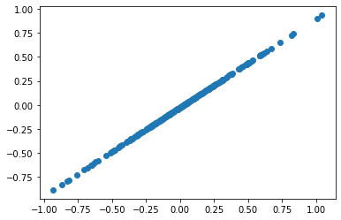|                     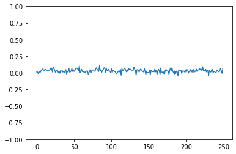|
| NHR            |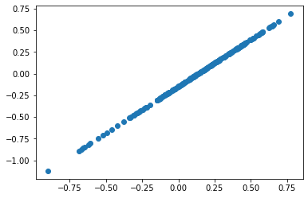|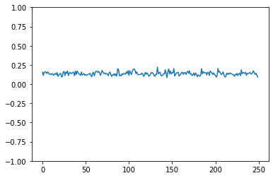|
| Duration       |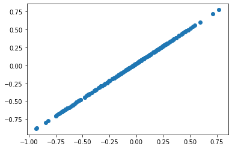|                     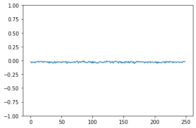|

#### Range with adaptation strategy

I believe this strategy most resembles similarity, with some elements of convergence introduced as a natural consequence of the algorithm.

For this strategy, the agent starts with a simple range strategy but transitions to a speaker-relative strategy. I tried several approaches for making this work, and settled on one where a set number of general male speech features are removed for each turn, and they are replaced by a single feature vector from the actual speaker. The number of general features removed each turn can be adjusted to control how quickly the features transition from general speech patterns to one specific to the speaker, and for some features this appears to have a kind of convergence effect where the feature vectors resemble their ideal value less at early steps and more at later steps.

| Feature        | Correlation | Difference over time |
|----------------|-------------|----------------------|
| Pitch mean     |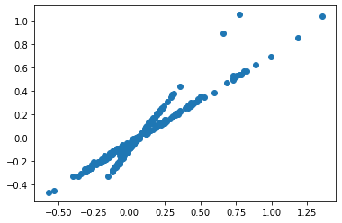|                     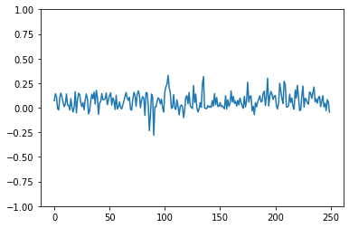|
| Pitch range    |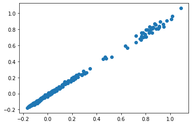|                     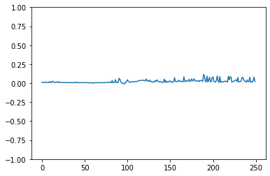|
| Intensity mean |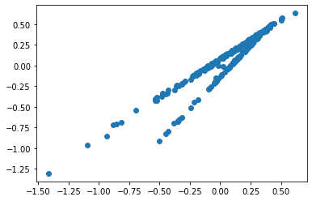|                     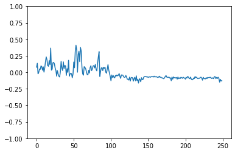|
| Jitter         |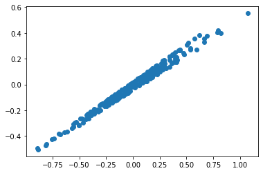|                     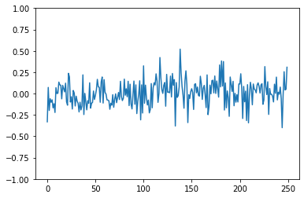|
| Shimmer        |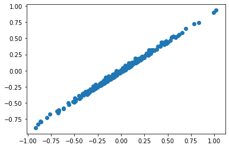|                     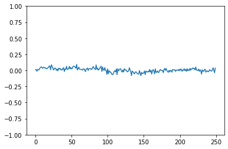|
| NHR            |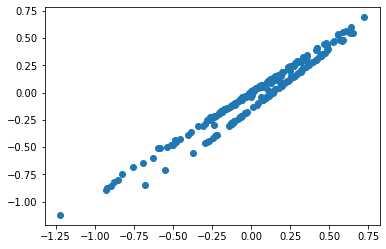|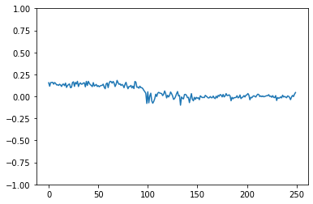|
| Duration       |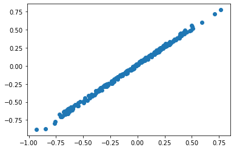|                     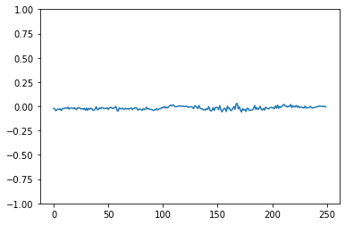|

### Next week

For next week:

* Continue optimizing WaveRNN. Continue work with the subscale variant, and explore pruning as another option.
* Replicate Andreas's neural entrainment measure. I want to start working on more elaborate neural entrainment strategies, and his work seems like a good place to start.