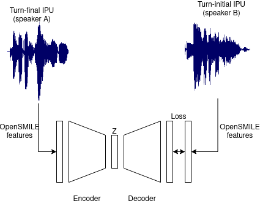
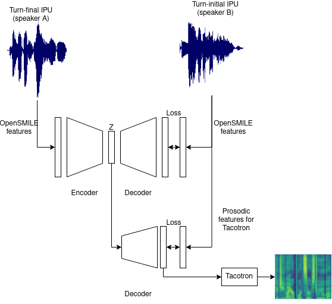

# Log 4-21-22

### Summary

Two major things this week:

1. Ongoing work with optimizing WaveRNN
2. Began implementing entrainment distance

### WaveRNN optimization

Not much to say about this, other than it is ongoing. Currently, the model is producing noise as output, but I suspect it's an issue with how I'm conducting inference. The batching strategy is incredibly complicated, which makes it hard to debug and is ultimately why this is going so slowly. I am hoping to have wrapped this up by next week.

### Entrainment distance

I am attempting to do several things at once with this work, with the ultimate goal of using it as a starting point to experiment with neural entrainment strategies. I am basing it off both [Andreas's paper](https://arxiv.org/pdf/2011.01860.pdf) and the [paper it was based on](https://arxiv.org/pdf/1804.08782.pdf), since they both do similar things, but to start with I am trying to recreate the NED metric on the Columbia Games Corpus, the Fisher corpus, and B-MIC.

I was also lucky to find the [author's GitHub page](https://github.com/nasir0md/unsupervised-learning-entrainment).

I currently have [a repository](https://github.com/mattm458/neural-entrainment) that performs the following tasks across several notebooks:

* Preprocesses the Columbia Games Corpus into turn-final and turn-initial IPUs
* Processes and normalizes acoustic features with OpenSMILE using the same configurations Andreas used in his paper
* Training the encoder-decoder model described in the paper and evaluating it based on real and fake IPU pairs

Unfortunately, my model is currently unable to discern real from fake IPU pairs (approximately 50% classification accuracy). At this point I do not believe it is an issue with the model itself, only with how the data is preprocessed. I am planning to reach out to Andreas to see if he can either share his code or go through my preprocessing code with him.

I have two specific things I want to do with this once I correct any issues with data preprocessing:

1. Evaluate the effect of additional data on the model's ability to discern real IPU pairs.

	a. We have a significant amount of extra participant data in B-MIC to correlate with the neural entrainment measures.
	b. The original work only looked at turn-final IPUs, and Andreas's work looked at both turn-final and speaker-initial IPUs. I want to try different methods for incorporating the entire conversational context into the encoder.

2. The current works around this method only use Z as a method of determining an entrainment distance, but I want to see how much predictive power it has. Use the model either as-is or with additional information incorporated in (1) to rework Z to output the limited set of prosodic features I've incorporated into Tacotron, and use it as an entrainment strategy in the dialogue system.

### Next Week

I am hoping to have the following things done next week:

* Functional subsample WaveRNN integrated into the dialogue system
* Working preprocessing and demonstrated recreation of the neural entrainment measure. We can talk about what to do next at that point.