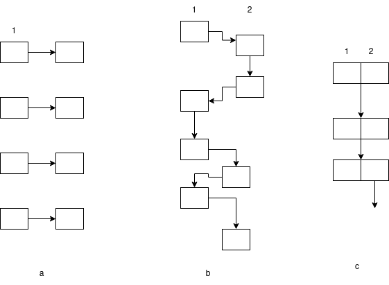

# Log 5-12-22

### Summary

This will be a pretty short update this week. I had a lot of coursework competing for my time.

I am working on producing a generative model for entrainment. I have several model architectures in progress, but do not expect to have results from them this week. The following is a brief outline of the current state of the work, as well as what I plan to finish for next week.

### Generative entrainment model

I am currently working on three styles of model:

a) involves using only the previous utterance to predict the features of the current utterance. This is essentially unchanged from the original neural entrainment model, but is being evaluated in terms of its predictive ability rather than its ability to act as a nerual entrainment measure.

b) involves using each utterance from each speaker in sequence, and using the collected conversation history to predict the features of the current utterance.

c) involves using only turn pairs to predict the features of the current utterance. That is, only adjacent turn pairs from different speakers are considered, but any intermediate utterances are discarded and not considered by the model.

I have three variations of this in progress:

	* Features extracted from OpenSMILE
	* Mel spectrogram data, put through the same model architecture as my Tacotron prosody detector from before
	* Word embeddings extracted from conversation transcripts

### Next Week

I am done with most of my work for the semester this week, so I can focus on finishing these and getting some results.