# Log 5-19-22

### Summary

I have three models to evaluate this week: a baseline, a model that predicts the turn-initial features from a turn-final IPU, and a model that predicts a sequence of turn-initial features from a sequence of turn-final IPUs. All three models do this from the Mel spectrogram of the input audio, not extracted features. Additionally, the models predict the 7 features we have for Tacotron prosody control, not the 220+ features extracted from OpenSmile.

None perform particularly well, but these are all minimal models. There are many directions I could go in after this to improve their performance.

### Results

#### Baseline
The baseline model only predicts features from an IPU Mel spectrogram, and is intended more as a demonstration that the model is capable of extracting prosodic features. It is a simplified version of the emotion detection model I used for the Tacotron prosody control system. I intended this to be a test of whether the model works with the Fisher corpus, and if a smaller model with fewer convolutional layers still works.

| Feature         | r     | Graph |
|--------------|-----------|------------|
| Pitch Mean | 0.6728588225558417     | 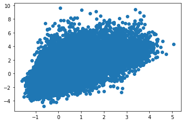|
| Pitch Range | 0.5583704312445422     | 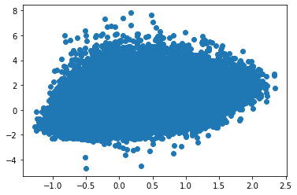|
| Intensity Mean | 0.737378473924341     | 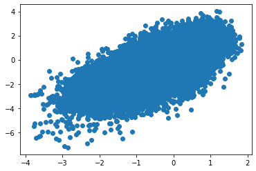|
| Jitter | 0.6299548536012014     | 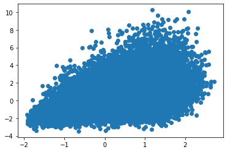|
| Shimmer | 0.5521435304198188     | 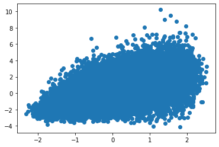|
| NHR | 0.7092470885995495     | 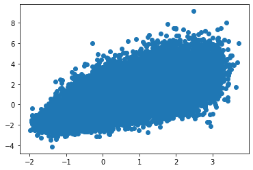|
| Rate|0.8206221205808695     | 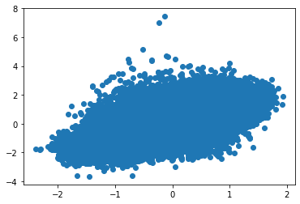|

#### Simple predictive model

The simple predictive model is more similar to the neural entrainment measures, but like the baseline model, it is predicting the feature set of a turn-initial IPU based only on the Mel spectrogram of a turn-final IPU. It does not perform well, and the only turn-initial features that have any semblance of similarity to their actual value is speaking rate and mean intensity.

| Feature         | r     | Graph |
|--------------|-----------|------------|
| Pitch Mean | 0.14541484123660195     | 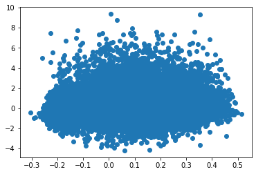|
| Pitch Range | 0.07630367780078749     | 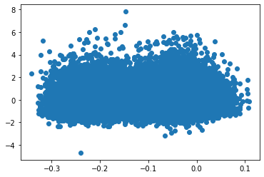|
| Intensity Mean | 0.2516469654791778     | 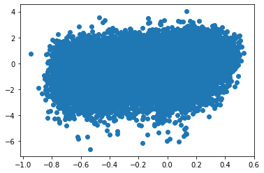|
| Jitter |0.036940511863355285     | 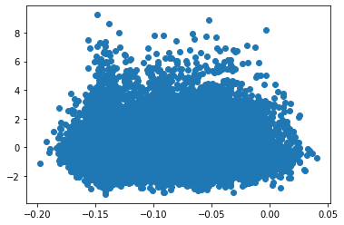|
| Shimmer | 0.06773786028784469    | 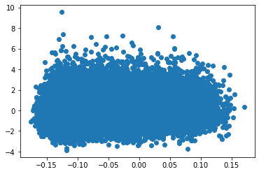|
| NHR | 0.11389459897997704    | 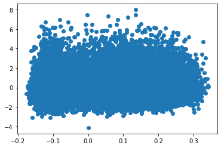|
| Rate|0.33295877970424337    | 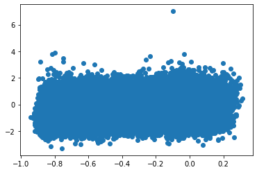|

#### Recurrent predictive model

Unfortunately the model was not saving checkpoints during training, and I did not discover the issue until this morning when I began summarizing results. However, I am anticipating that this will work better than the simple predictive model, and will be a useful testbed for adding extra modules like attention.

The model works by analyzing the Mel spectrograms of all turn-final IPUs from one speaker, then runs them all through a unidirectional recurrent network before predicting turn-initial IPUs of the other speaker.