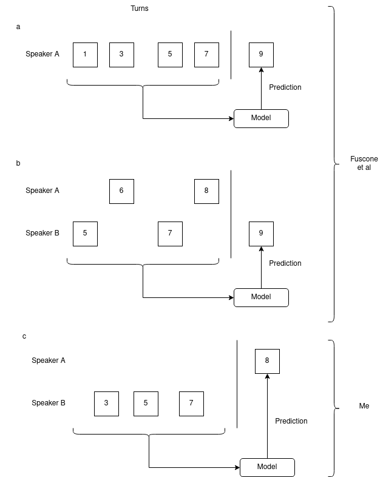

# Log 5-26-22

### Summary

I was too busy with finals, grading, my own coursework to spend much time on audio this week. However, I did find another interesting paper to work with, and I did a few more experiments related to how input is given to the model.

### Paper overview

Andreas sent me [this paper](https://hal.archives-ouvertes.fr/hal-03224194/document) a while ago and I finally looked at it this week. It is a much better basis for what I'm trying to do than the neural entrainment paper, and it specifically lists dialogue agents as an application for this work. Additionally, the paper describes a specific (and very simple) recurrent model architecture that I adapted here. There is also [source available](https://github.com/simonefu/NLP-predicting-next-turn).

I am feeling good about some of the tests I was working with last week, because the Fuscone paper does a few of the same things that I tried. This is an outline for the different approaches I tried:

The paper uses 3 turn-level features (not IPU-level): pitch range, energy, and speaking rate. The model is only a one-layer LSTM that accepts the 3 turn-level features as input, expands it to a larger hidden layer (the paper uses a dimensionality of about 20-40), which is shrunk to a 1-dimensional output that predicts a single feature value. For this, I focused on energy.

The only significant difference between what I did and what the paper did (besides the usual differences in computing the feature values) was that the paper used Switchboard, and I used Fisher since I already had a processing pipeline ready for it. I also tried an alternate input (c in the figure above) where I use one speaker's features exclusively to predict the other's.

The paper attempted building a tail of 1, 5, and 10 turns to feed into the model. I tried both 5 and 10 and didn't bother with 1, since it has never worked well for me. I also tried 15 out of curiosity to see what it would do to the results.

These are the results duplicated from the paper:

| N  | Input style |Corpus     |L1 Smooth Loss|
|----|-------------|-----------|-------|
| 5  | a           |Switchboard|0.380  |
| 10 | a           |Switchboard|**0.377**  |
| 5  | b           |Switchboard|0.357  |
| 10 | b           |Switchboard|**0.353**  |

And these are my results:

| N  | Input style |Corpus     |L1 Smooth Loss|
|----|-------------|-----------|-------|
| 5  | a           |Fisher|**0.385**  |
| 10 | a           |Fisher|0.387  |
| 15 | a           |Fisher|0.390  |
| 5  | b           |Fisher|**0.374**  |
| 10 | b           |Fisher|0.377  |
| 15 | b           |Fisher|0.377  |
| 5  | c           |Fisher|**0.387**  |
| 10 | c           |Fisher|0.388  |
| 15 | c           |Fisher|0.390  |

So this looks like I'm continuing with this grand tradition of being unable to replicate results exactly: for my Fisher experiments, it seems like shorter tails are better than longer tails where the opposite is true in Switchboard (the original paper).

However, it does seem like approach B (using data from both speakers) is the way to go regardless of how many turns we look at, and I'm wondering if it might be useful to reexamine my approach to look at this as a kind of teacher forcing, and see how good or poorly the model does when it is fully autoregressive.

So that's where I am this week. I am completely done with everything for this semester as of yesterday, so I'm going to be able to spend more time on this next week.