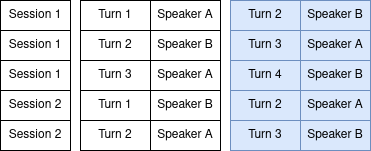
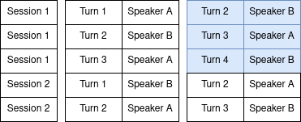
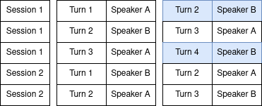
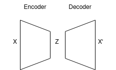
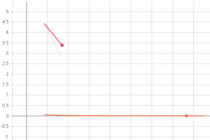

# Log 5-5-22

### Summary

Things aren't extremely busy yet, but my end-of-semester work is starting to pick up. I may be getting fewer things done in the near future.

Entrainment distance work is still ongoing. I am still having difficulty replicating the original paper, so this update is a record of what I've tried so far and what my code is doing.

### Entrainment distance

There are two significant lines I am investigating: the dataset and the method.

For the dataset, I reviewed Andreas's code and found that my dataset code was not producing enough turn pairs, and possibly making some incorrect turn pairs. I adjusted my dataset generation code and confirmed that it was producing the same number of pairs as Andreas's code, and verified that they were the same within several sessions.

I got Andreas's code working to the point that I could begin training subsets of his model, and verified that my model was learning in a way that resembled his. I confirmed that our hyperparameters and model architectures were either the same or similar (there is some variation with Md's code).

At a certain point, I made the decision to assume that my model is probably correct (it is very simple) and decided to focus on my procedure for managing turn data and generating fake turns.

For managing turn data, I have:

* Made a train/test/validate split across all turns, regardless of session (This may be what Andreas is doing).
* Made a train/test/validate split across session numbers only, then incorporating all turns from that session into each dataset (this is what Mr is doing).

For generating false turn pairs, I have employed the following strategies:

* Shuffle all turn-initial chunks regardless of speaker or session, resulting in many turn pairs between speakers who never interacted: 

* Shuffle all turn-initial chunks within a session, regardless of speaker. This means that some turn pairs may be between the same speaker, but the effect is that the model is considering non-adjacent turns within the session. Note that, in this image, there are follow-up steps to shuffle subsequent sessions. 

* Shuffle all turn-initial chunks within a session and speaker. This means that all speaker pairs remain intact (A always precedes B and B always precedes A), but the pairs are non-adjacent. Note that, in this image, there are follow-up steps to shuffle subsequent speakers and sessions. 
* 

None of these approaches seem to make a difference, and I am still getting a classification accuracy around 45%-51%.

Additionally, though both papers appear to use the embedding Z generated by the encoder when evaluating the model against real and fake pairs, I tried evaluating both the embedding Z and the decoder output X'. This also did not have an effect, and prediction accuracy remained around 50%.

Finally, I noted that Md's code contained vestiges of a variational autoencoder, with commented-out reparamaterization functionality. So I decided to try it and see what happened. Using a VAE had a significant impact on the loss during training. I had begun trying different loss functions at this time, so I was trying this with MSE. But without the variational autoencoder, training loss was around 3, but with the variational autoencoder, training loss was well below 1. Below is a screenshot of an incomplete training session with MSE but without the VAE (magenta), and another training session with MSE and with a VAE (orange). Unfortunately, this did not translate to an increase in prediction accuracy, which continues to hover around 50%.

So it is kind of frustrating I am having so much trouble recreating results from such a simple model. I am currently working on getting Md's code to work - unfortunately the code is in an extremely outdated version of Python, and it looks like there are some serious disconnects between what the preprocessing code is doing and what the model training code is expecting to have available.