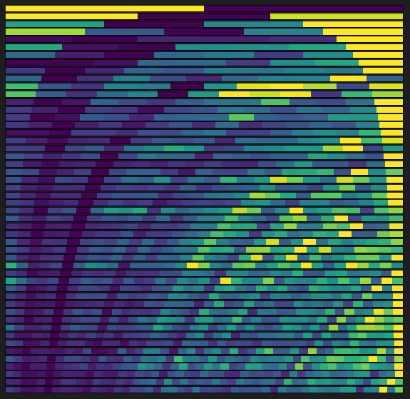
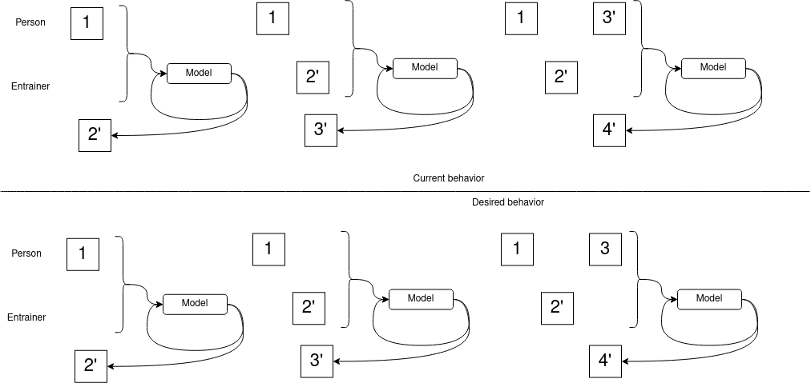

# Log 6-16-22

### Summary

This week, I further improved the attention mechanism on my model and revisited some of my assumptions around teacher forcing. I believe I now have a general approach that can be made to work in the dialogue system, but there are some details I want to iron out first.

### Attention revisited

Last week, I described some issues with the attention mechanism, and how it focused at the beginning of the conversation in a way that I believed was problematic. I attempted each of the things I described in the previous update, as well as a few other things.

Based on some of my suspicions from last week, here are some things I did with the attention mechanism this week:

#### Location-sensitive attention

The main issue I found with Bahdanau attention was that it becomes attached to early turns, and continues to emphasize them as the conversation progresses. Last week, I posted the following image as a representative example of what I was seeing in the results:

I made a new graphic this week that illustrates this better. This depicts the attention predicting the first 50 turns in one conversation (this is not the same example as above, so it is not stuck at the beginning in exactly the same way):

You can see the model pays the most attention to turns earlier in the conversation, and it is not until later that it starts to consider some later turns. I didn't think this was correct, and an intuitive explanation might be trying to guess what happens next in a book by spending most of your time studying the first chapter.

I tried implementing [location-sensitive attention](https://paperswithcode.com/method/location-sensitive-attention), the same mechanism used in Taoctron. It works by maintaining two additional pieces of context: an attention context vector updated by a separate RNN, and a cumulative attention score vector containing the sum of all scores assigned previously. The theory behind this is that it is supposed to help move attention forward, and it appears to have worked:

This seemed better, but as training progressed and validation plateaued, the attention mechanism eventually became stuck at the end of the input:

So this was probably not the right approach.

#### Bidirectional Encoder LSTM

Any possible benefits from doing this are offset by how incredibly computationally intensive it is, and it had comparatively poor results.

#### Tweaking Bahdanau attention

In the end, I spent some time tweaking my Bahdanau attention mechanism. I changed where it was (I had it attached to the decoder instead of the encoder), I allowed it to train longer, and experimented with different teacher forcing sessions. Eventually, I found that it will eventually produce attention alignments that look reasonable to me, as shown below:

I think this is ultimately the right approach, and the attention alignment at least seems like there is something it is looking for. I will spend some time investigating what it is paying attention to, and if there are any interesting patterns there.

### Reframing the problem for a dialogue engine

There is a subtle difference in how my model currently behaves, and how it will behave in a dialogue system. The difference is shown in the diagram below:

In the current configuration, the model always predicts the next turn, regardless of who is speaking it. This means that the model is predicting both the dialogue system's responses and its partner's responses. Using the current teacher forcing/autoregressive system, this means that the model's predictions of its human partner are fed back into the input data. This is shown in the upper part of the diagram, where the model's prediction of the third turn (3') is used to predict its own response 4'.

However, this is not what will happen in a conversation system. In a real conversation, the model's prediction of the third turn (3') ultimately doesn't matter, because its human partner will speak however they want, and the model has to predict based on this. This is depicted in the bottom graphic, where the model's prediction of 3' is discarded when the human partner speaks the real turn 3.

I am starting to run some early experiments around this by doing a hybrid teacher forcing prediction method, designating one speaker the human and one speaker the dialogue agent. In this syteem, our predictions for the dialogue agent are fed back into the data, while predictions for the human are discarded and replaced with real data.

The initial results are somewhat disappointing. It seems like allowing the model to autoregress the entire conversation performs better than doing this selective teacher forcing. Here is a comparison of L1 losses:

|Approach|L1|
|-|-|
|Autoregresses the entire conversation|0.207|
|Selective human/computer teacher forcing, evaluate predictions for ourselves only|0.371|

### What's next

I have two things I want to do next:

* Using the autoregressive/teacher forcing improvements I described in the last section, begin integrating the model with the dialogue engine.
* Attempt more robust training accounting for the fact that one set of predictions will always be discarded.