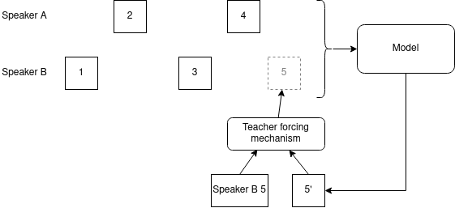

# Log 6-2-22

### Summary

This week, I added an attention mechanism to my entrainment model. The mechanism is capable of attending to the entire conversational history, though it could be modified to look at a shorter window like with prior versions of the model.

In addition, I modified the model to use a controllable amount of teacher forcing during training, and to revert to a fully autoregressive mode during inference. In general, I found that (unlike Tacotron), randomly disabling teacher forcing 50% of the time had a positive effect on model training.

### Attention

The attention mechanism is depicted below:

Some notes:

* The turns depicted as belonging to speaker A or speaker B consist of mean intensity, pitch range, speaking rate, and duration. This is the complete set of features extracted for the Fuscone paper currently available to me in the Fisher corpus. It omits dialogue acts, since those are unavailable for the Fisher corpus.
* The turn predicted by the decoder (turn 5 in the diagram) also consists of the 4 features extracted. Predicting all 4 features was required in order to make the model autoregressive, otherwise it would not have been possible to recirculate the predicted turn back into the model input alongside other inputs.
* The model performs slightly better with attention than without. However, I am not certain if it is learning any useful alignments yet.

Here is a performance comparison between the model with and without the attention mechanism. In these tests, the model is using the entire conversation history, with train/test/validation splits occurring at the session level. The models were trained with a batch size of 128, with lr=0.00001.

|Model    |Epochs|L1 Loss (Validation)|
|---------|------|--------------------|
|Baseline (Best from paper, speaker+partner, F0) | |0.299| 
|Baseline (5 turn window) | 3 | 0.3838|
|No attention       |10    |0.305               |
|Attention      |10    |**0.2294**              |

### Teacher Forcing

The teacher forcing mechanism is depicted below. It is similar to the mechanism I implemented in [Tacotron](https://github.com/mattm458/tacotron2/blob/main/model/tacotron2.py#L259).

During validation and inference, the probability of selecting ground truth turn data as the next turn to process is 0%, effectively making the model autoregressive. In this situation, it will always feed its own predictions back into itself.

During training, the probability of selecting ground truth turn data is controllable. For tests, I set it to two different values: 50% (the model will feed its own predictions back into itself about half the time) and 100% (the model will never feed its own predictions back into itself).

|Model    |Epochs|L1 Loss (Validation)|
|---------|------|--------------------|
|Baseline (Best from paper, speaker+partner, F0) | |0.299| 
|Baseline (5 turn window) | 3 | 0.3838|
|Attention (100% teacher forcing)     |10    |0.2302           |
|Attention (50% teacher forcing)     |10    |**0.2294**              |

### Next steps

I am getting close to having something to integrate into my dialogue system, but there are a few things I want to try modifying first.

Currently, I am curious if I'm doing teacher forcing the most realistic way given the circumstances of a dialogue. I think setting it at some halfway value like 50% is fine, but I'm curious whether it makes more sense to arbitrarily designate one speaker as the human and one speaker the dialogue agent, and only use autoregressiveness on the dialogue agent turns. Alternatively, 50% might be the best approach. I'm not sure if I'm thinking about this the right way, but I wonder if it's acting like random data augmentation.

Second, I really want to spend more time getting working on the attention mechanism to see if I can get some nice alignment charts out of it. It's clearly doing something because of the performance difference, but it would be nice to have some examples (and I guess if it really isn't aligning well, fixing that could improve model performance even more).