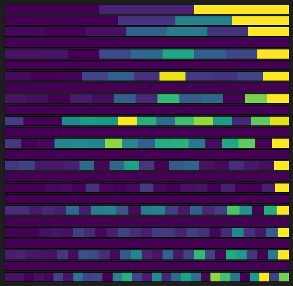

# Log 6-23-22

### Summary

This week, I began reworking the model code to make it possible to integrate with the dialogue engine. As part of doing this, I gained much more fine-grained control over the model's behavior during training and evaluation, so I tried several different configurations to test my earlier concerns about how the model behaves.

### Training strategies

The largest concern I had about the model was its purely autoregressive nature, in that it was only capable of predicting every timestep in the conversation despite this not being the goal of the model. To fix this, I introduced configurations to control whether we are working with **both** (our turns and our partner's turns) or **us** (our turns only). This can be configured separately for training, loss computation during training, inference, loss computation during inference, and which turns are eligible for teacher forcing.

* **Training**: These options control how data flows through the model during training. They only affect the attention mechanism and the decoder. The encoder still accepts the entire conversation history.
	* If **both** is configured, the decoder will predict both our and our partner's turns during training.
	* If **us** is configured, the model will predict our turns during training.
* **Training Loss**: These options control which decoder predictions are used during backpropagation.
	* If **both** is configured, backpropagation will account for both our and our partner's predicted turns. *The Training option must be **both**.*
	* If **us** is configured, backpropagation will account for only our predicted turns. *The Training option can be **both** or **us**.*
* **Inference**: These options control how data flows through the model during inference. They only affect the attention mechanism and the decoder. The encoder still accepts the entire conversation history.
	* If **both** is configured, the model will predict both our and our partner's turns during inference.
	* If **us** is configured, the model will predict our turns during inference.
* **Inference Loss**: These options control which decoder predictions are used to evaluate the model between epochs.
	* If **both** is configured, smooth L1 loss will be computed for both our and our partner's turns. *The Inference option must be **both**.*
	* If **us** is configured, smooth L1 loss will be computed for only our predicted turns. *The Inference option can be **both** or **us**.*
* **Teacher Forcing**: These options control which predictions can be fed back into the model input during training.
	* If **both** is configured, both our and our partner's predicted turns will be fed back into the model's input. *The Training option must be **both**.*
	* If **us** is configured, only our predicted turns will be fed back into the model's input. *The Inference option can be **both** or **us**.*
	
I believe the **us** teacher forcing setting most closely resembles real-world usage of the model in a dialogue system.

### Results

| Performance | Training | Training loss | Evaluation | Evaluation loss | Teacher Forcing | L1 Loss    | Checkpoint | Notes                                                                                                                              |
|-------------|----------|---------------|------------|-----------------|-----------------|------------|------------|------------------------------------------------------------------------------------------------------------------------------------|
| Low         | Both     | Us            | Both       | Us              | Both            | 0.3908     | 234        | Training halted early due to plateauing validation loss                                                                            |
| Low         | Both     | Both          | Both       | Both            | Both            | 0.3894     | 232        | Same configuration as the baseline, 100% autoregressive during inference. Training halted early due to regressing validation loss. |
| Medium      | Both     | Both          | Us         | Us              | Both            | 0.384      | 233        |                                                                                                                                    |
| Medium      | Both     | Both          | Us         | Us              | Us              | 0.3835     | 239        |                                                                                                                                    |
| High        | Both     | Us            | Both       | Us              | Us              | 0.3816     | 238        |                                                                                                                                    |
| High        | Us       | Us            | Us         | Us              | Us              | **0.3815** | 229        |                                                                                                                                    |                                                    |

Based on the above, the two best-performing models have the following characteristics in common:

* Partner turns are always teacher forced during training, so they are always the same across multiple training runs regardless of teacher forcing settings. The only turns that can be fed back into the model input are our own turns that we predict.
* During training, it is better to conduct backpropagation only from our turn predictions. Regardless of whether the model predicts our partner's turns or not, they should not contribute to training the model (except indirectly).

At the moment, the best option appears to be a model that only predicts our turns from the conversation history. This has extra benefits in that it is a little faster to train than other options.

### Attention

Some of the attention charts are more interesting for the configurations in the table above. For example, here are some attention scores for the highest-performing model:

The blank lines are timesteps where our partner spoke, which we do not predict in this model. The other lines are timesteps where we are predicting our own output.

### What's next

Here's what I want to do for next week:

* Finish integration with the dialogue engine.
* Begin incorporating additional features into the model and tie up other loose ends I wanted to experiment with.
* Make a better attention visualization incorporating turn features.