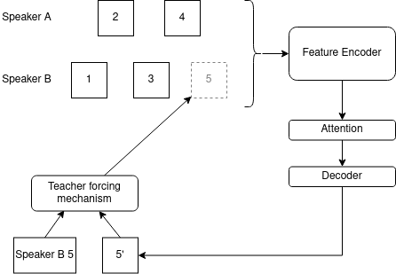
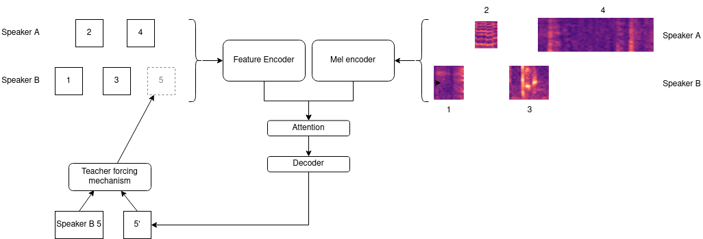
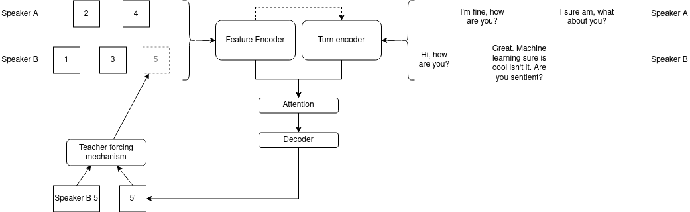

# Log 6-30-22

### Summary

This week, I experimented with a few additional sources of data to improve model performance. I spent a while trying to incorporate Mel spectrograms as additional input before deciding to abandon it, for both performance and training-related reasons. However, incorporating word embeddings from the transcripts was a big success.

### Training with Mel spectrograms

To start, here is the base model:

In the base model, the conversation history consists of turn-level features. The features are encoded producing a series of turn embeddings. For each predicted turn, the input embeddings are selectively emphasized by the attention mechanism, and the decoder predicts the features at the next timestep.

My attempt at training with Mel spectrograms involved a model like that depicted above. In the spectrogram-enhanced model, the conversation history consists of both turn-level features and Mel spectrograms generated from each turn. The features and spectrograms are encoded by separate encoders and concatenated into one series of turn embeddings. For each predicted turn, the input embeddings are selectively emphasized by the attention mechanism, and the decoder predicts the features at the next timestep.

As seen in results table below, doing this actually made the results *worse* - the same model architecture without Mel spectrograms performed better than the one with Mel spectrograms. To make the situation more complicated, the model with Mel spectrograms trains significantly slower than without. The Mel spectrogram model takes about an hour per epoch, whereas before it took less than a minute. This is partly because Mel spectrograms expanded in a way that allows the encoder to work consumes a lot of memory - Mel spectrograms are high-dimensional and need to be padded with 0s, which consumes a lot of space. Even in a multi-GPU environment, the combination of the padded spectrogram data and accumulated gradient means that each card can only handle batches of 2.

However, I ultimately decided to abandon this approach. Partly it was the complexity of the training process, but also because I realized Mel spectrograms can never be fully autoregressive like predicted features can be. So while we can feed our own predicted features back into the encoder, we cannot feed a predicted Mel spectrogram into the encoder because we are not engaging in TTS as part of the training loop. This gets us in a situation where teacher forcing settings *can only apply to features, not Mel spectrograms.*

If I revisit this in the future, I could alter it so that only the partner's Mel spectrograms are considered.

### Training with Word Embeddings

In my embedding-enhanced model, the conversation history consists of both turn-level features and turn embeddings generated from the words in each turn, accumulated from GloVe word embeddings.

The features and turn embeddings are encoded by separate encoders and concatenated into one series of turn embeddings. The turn encoder contains its own attention mechanism to selectively emphasize and deemphasize different words as it is accumulating them into a single turn-level embedding. The conversation history consists of the encoded features and encoded turns concatenated together. For each predicted turn, the historical embeddings are selectively emphasized by the attention mechanism, and the decoder predicts the features at the next timestep.

There are some specifics around the model architecture I arrived at, and there are a few tweaks could do to any of the following:

* The turn encoder contains its own attention mechanism to selectively emphasize different words in the turn. Currently, the accumulated encoded features contributes to this, allowing some part of the conversation history to determine which words are most important.
* The model currently only considers text from turns *prior to the one being predicted*. However, in a dialogue system, we likely have access to text from *the turn whose features are currently being predicted* since it can be generated prior to activating the neural entrainment system. This information could be extremely useful to the model.
* I do not believe text has the same autoregressive issues as Mel spectrograms, since a dialogue system would generate a textual response separately from the TTS. However, if we ever make a dialogue system that can entrain lexically, this would no longer be true.

### Results

| Performance | Training | Training loss | Evaluation | Evaluation loss | Teacher Forcing | L1 Loss    | Checkpoint | Extra Data                                                                                                                              |
|-------------|----------|---------------|------------|-----------------|-----------------|------------|------------|------------------------------------------------------------------------------------------------------------------------------------|
| Low        | Us       | Us            | Us         | Us              | Us              | 0.3859 | 253        |                                                                                 Mel spectrograms                                                   |                                                    |
| Medium        | Us       | Us            | Us         | Us              | Us              | 0.3815 | 229        |                                                                                            None                                        |                                                    |
| High        | Us       | Us            | Us         | Us              | Us              | **0.3663** | 306        |                                                                                 Word embeddings                                                   |                                                    |

### Quick status update on the dialogue system

I am still working on integrating this with the dialogue engine. I think it would be useful to decide on a soft deadline for getting it working - maybe we can plan out a rough timeline for experimenting.

### What's next

Here's what I want to do for next week:

* Finish integration with the dialogue engine.
* Try a few alternative designs for the word embedding model for a more exhaustive results comparison.