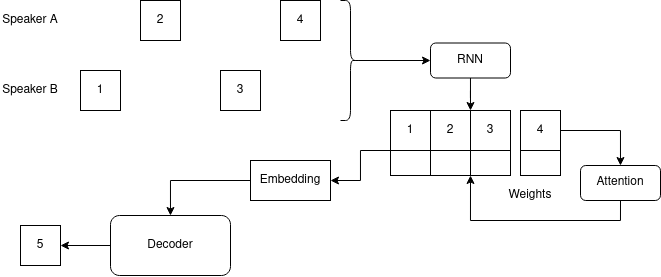
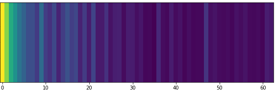
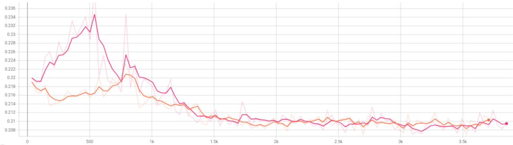
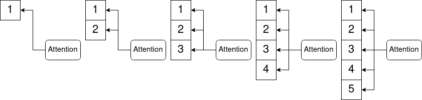

# Log 6-9-22

### Summary

This week, I improved attention on my model. It now uses a more standard Bahdanau attention mechanism, which appears to work and selectively focus on different turns from the conversation history. However, a quirk of how the training loop operates means that the attention mechanism learns to pay the most attention to early turns.

### Attention

The model now uses additive, or Bahdanau-style attention: https://paperswithcode.com/method/additive-attention.

Despite the different mechanism, fundamentally the model is no different from this diagram I included last week:

So there is good news and (possibly) bad news regarding the attention mechanism. The good news is that it appears to work, and produces alignment charts like the following for a single turn prediction. Aside from the major emphasis on the early turns, there are identifiable cases of some turns contributing more than others (brighter rectangles indicate a higher alignment score):

However, all of the attention alignment charts I observed focused the most on the first few turns, and had very little variation in the score for later turns. This chart shows the alignment for mean intensity, which actually had more variation in later turns than pitch, which were almost entirely uniform.

I am not sure if it is a problem or not, so I will discuss two possible interpretations.

One interpretation is that the model found a good alignment, and the attention scores indicate that the first few turns are the most useful for predicting entrainment behavior. This could be true, but I doubt it: I tested predicting mean intensity with and without the attention mechanism and found almost no difference in L1 loss (red is without attention, orange is with):

So either attention is not useful for this problem (I doubt this is true), or it means that the model is finding a suboptimal alignment.

The other interpretation is that this is a problem, and it is likely happening due to the structure of the training loop. The issue is that my approach assumes the conversation is happening in real time, so the model can only attend to turns that have occurred so far:

This approach means that the attention mechanism is most likely to focus on early turns, not because they are useful, but because they occur the most frequently. In the example above, the attention mechanism will have seen turn 1 for all 5 timesteps, but will only have seen turn 5 once. Of course turn 1 is useful in early steps because it is the only information available, but as training progresses, the later (and probably more useful) turns are not available as examples to the attention mechanism as often.

I have three ideas for fixing this:

1. Abandon using the entire conversation history and switch back to a windowed approach.
2. Try [location-sensitive attention](https://paperswithcode.com/method/location-sensitive-attention) instead. This method claims to help the model move forward through the inputs, but I have only used it on Tacotron where all encoder timesteps are already available. I'm not sure how well it will work in this context.
3. Use a bidirectional RNN in the encoder instead of unidirectional. This would require recomputing the entire turn sequence on every timestep, but this means the contents of each turn would change on every timestep. I think this might help the attention module move on from the beginning, since the beginning wouldn't contain the same value over and over again.

### Other things

I added a few other things, but the attention kept me busy for most of the week. In no particular order:

* Teacher forcing can now happen on a schedule, which I have been using for most of the work above. However, I don't want to focus on it too much until I'm happy with the state of the attention mechanism. I have a half-baked guess that allowing limited autoregression was actually compensating for the attention issue by randomly messing with values in early timesteps.
* I added the ability to output single features instead of the entire feature vector. Predicted values are injected at the appropriate index in subsequent turns. I don't think this is very realistic since there is no ground truth for the non-predicted values in a real conversation, but it could help me compare this to the original paper if necessary.