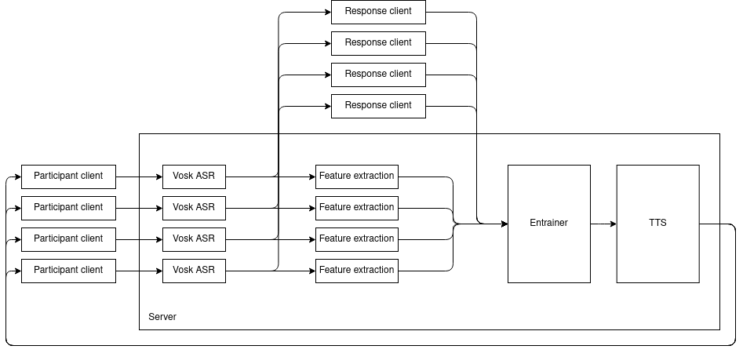

# Log 7-21-22

### Summary

I am rewriting the dialogue engine with a bunch of new features and a client/server model. As a result of the rewrite, it has better ASR, and is being done in a way that will allow it to manage multiple simultaneous conversations.

### Dialogue engine progress

Like I discussed in my last update, the previous version of the dialogue engine hit a dead end because it is only possible to run it on one machine. Because of this, I decided to abandon it as a proof of concept and rewrite it. The rewrite adopts a client/server architecture, and I am designing it so the server can handle multiple simultaneous conversations.

I decided to do the rewrite in Java, for a couple of reasons - mainly so I can reuse or adapt parts of Andreas's code from B-MIC, but also because I'm more confident in Java's concurrency than I am with Python's.

The engine is here: [JDialogue](https://github.com/mattm458/jdialogue)

These are roughly the components the system needs:

* ✅ Participant client capable of recording and sending audio packets over a network
* ✅ Server capable of receiving audio packets and feeding them into a processing pipeline
* ✅ ASR module that breaks recorded audio into chunks with automatic transcriptions
* ✅ Feature extraction module that calls out to Praat
* Make the neural entrainer and Tacotron models TorchScript-compatible, then compile and export them.
* Load TorchScript models into server pipeline and conduct inference
* Participant client capable of receiving and playing audio packets
* Response client capable of playing audio packets and sending response text to the server
* Server is capable of receiving audio packets from multiple clients and feeding them into several parallel processing pipelines  

In no particular order, here are some aspects of the engine I am concerned with and trying to work through:

#### Speed

I am concerned with the speed of the processing pipeline, although it is a little premature because I haven't finished all the components yet. However, the slower it is, the longer a participant will have to wait before hearing a response. It might be useful to decide on a target response time and try to meet it.

#### Faster audio feature extraction

With the speed concerns I described above, I'm concerned that feature extraction will be a bottleneck. To use Praat, I have to save a WAV file in temporary storage then call out to Praat a separate process, then use string processing to extract the results. Is there an equivalent native Java audio processing library? I found a few ([JDSP](https://jdsp.dev/) looks solid), but it is very low-level and doesn't directly compute the features we're interested in.

As shown in the diagram above, feature extraction and response generation can happen in parallel. So this may not be an issue, because entrainment and TTS cannot begin until both features and a textual response are available.

I will continue to use Praat for now, but will keep an eye out for alternatives. If I change the feature extraction method, I will probably have to retrain both the neural entrainer and Tacotron.

#### ASR issues

As part of the rewrite, I switched from the Sphinx ASR library to Vosk. Vosk is the successor to Sphinx, and it produces much higher quality output. However, Vosk has some quirks. One recurring issue is with pauses: it will occasionally incorporate long periods of silence into a word, resulting in absurd text alignments. For example, it sometimes claims that a short "hello" is two seconds long.

I am planning to get around this with a VAD engine. At the moment, I am planning to use a library I found that uses the same VAD as the WebRTC for streaming microphone input in Web browsers. I don't want to use energy from OpenSMILE like Andreas did, since it would be another call to an external process.

Didn't Andreas use Watson to transcribe B-MIC? Is that an option here?

Also: The ASR occasionally makes mistakes and doesn't segment input speech like how we usually define it. I am considering processing my corpora with the ASR engine and segmenting them however Vosk wants, then retraining the neural entrainer with this. This would allow the entrainer to account for the kinds of mistakes and dialogue segments that Vosk usually makes.

#### Normalization

I am still thinking about the best way to handle data normalization since, unlike with dialogue corpora, we know nothing about a participant until they speak to the system for the first time.

Some options I am considering:

* Find mean and standard deviations by gender and normalize by these.
* Do some kind of advanced data analysis of a dialogue corpus. Find clusters of speakers with similar voices and associate new speakers with a cluster, then use the mean and standard deviation of the cluster.
* Accumulate means and standard deviations as the conversation progresses, permitting swings in normalized values early in the conversation or cutting them off at 0 until enough data is collected.
* Address normalization as part of the experiment design. Adopt a calibration procedure where participants speak alone or read a text aloud.

Adopting any of these options will require approximating them in the neural entrainer training procedure, then retraining it.

### What's next

Aside from more experimentation with the neural entrainment training loop, I am going to focus on the dialogue engine.