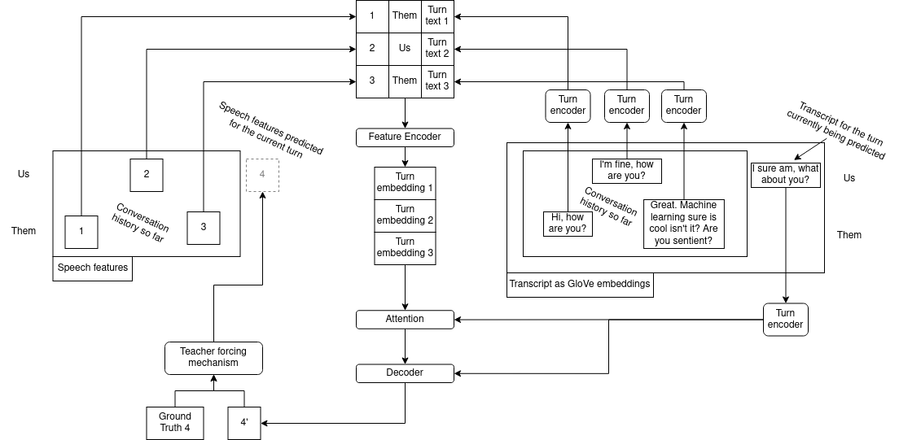

# Log 7-7-22

### Summary

This week, I arrived at what I believe is the most optimal model architecture for incorporating word embeddings. It outperforms everything else I've done before. I also have much more insight into the attention mechanism, and can produce charts showing transcripts with associated attention scores.

### Training with Word Embeddings, version 2

Last week, I tried the following architecture for incorporating word embeddings into the model:

However, I observed that a dialogue engine likely has access to text from *the turn whose features are currently being predicted*, and this was not reflected in the model architecture.

Additionally, in this version of the model, the *dialogue-level speech feature embedding was used to produce a turn-level transcript embedding*, which I now believe is backward. My rationale is that, while word selection is important, the speech features contain much less information than the words. So it is probably better to allow the semantics of the transcript to dictate attention. 

The improved and hopefully somewhat streamlined model is shown below, with additional detail. It is not as different as it looks, only some parts of the diagram were restructured for clarity:

The model contains two separate, unrelated encoding steps:

1. GloVe embeddings of the transcript are encoded into turn-level text embeddings. The text encoder has its own attention mechanism to identify important words which is isolated from the rest of the model. *The turn-level encoded text is treated as a feature, and is concatenated with the input speech features*.
2. Input features, including speech features, the turn speaker, and turn-level encoded text, are encoded as a sequence.

Separately from this, the textual transcript of the turn currently being predicted is encoded as a turn-level text embedding. This upcoming-turn text embedding is used in both the attention mechanism (deciding which input features are important) and in the decoder (as additional information to help it predict the output speech features).

| Performance | Training | Training loss | Evaluation | Evaluation loss | Teacher Forcing | L1 Loss    | Checkpoint | Extra Data                                                                                                                              |
|-------------|----------|---------------|------------|-----------------|-----------------|------------|------------|------------------------------------------------------------------------------------------------------------------------------------|
| Low        | Us       | Us            | Us         | Us              | Us              | 0.3815 | 229        |                                                                                            None                                        |                                                    |
| Medium        | Us       | Us            | Us         | Us              | Us              | 0.3663 | 306        |                                                                                 Word embeddings (old)                                                   |                                                    |
| High        | Us       | Us            | Us         | Us              | Us              | **0.3125** | 310     |                                                                                 Word embeddings  (V2)                                                  |                                                    |

### Attention revisited

### What's next